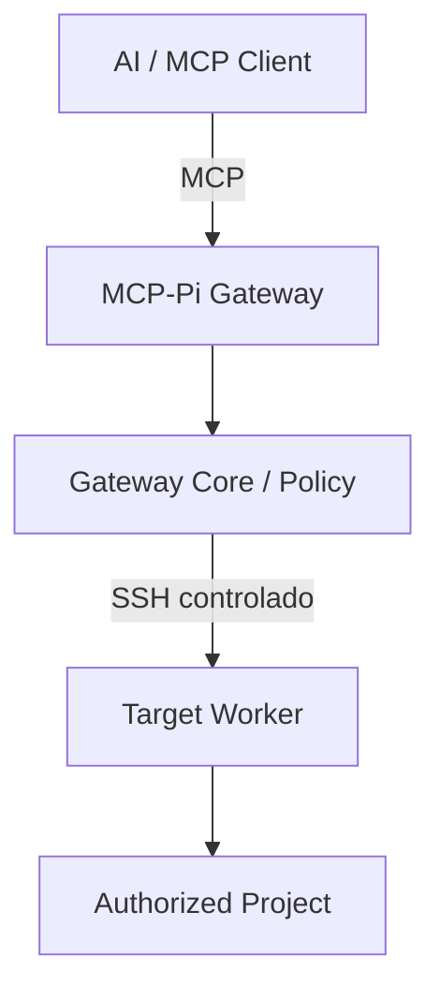

# AGENTS.md — Contrato Operativo para Agentes Autónomos e IA

> Guía operativa obligatoria para cualquier IA o agente que trabaje con **Local-miniMCP / MCP-Pi Gateway**.
>
> Leer este documento **antes de modificar runtime, configuración, releases, red, identidades, Registry o documentación**.

| Campo | Valor |
| --- | --- |
| Rol del documento | Contrato operativo para agentes |
| Software baseline | **MCP-Pi Gateway v1.0.1** |
| Release estable | `v1.0.1` — commit `bcd8fe907f9e305733896f1d286d04d57a8b1f5e` |
| Hardware | Raspberry Pi Model A+ Rev 1.1 — ARMv6 |
| Baseline histórico validado | Bullseye / Debian 11 — **preservado como physical rollback** |
| OS de producción actual | **Raspbian GNU/Linux 13 / Debian 13 Trixie — armv6l** |
| Fase operativa actual | **POST_V1_OPERATION_AND_MAINTENANCE** (Phase 8 CLOSED / PASS) |
| Principios rectores | **KISS + Reuse First + Least Privilege + Deny by Default + Fail Closed** |

Documentación relacionada:

- `docs/project-state.md` — estado dinámico y cronología;
- `docs/v1-acceptance.md` — aceptación de v1;
- `docs/releases/v1.0.1.md` — release actual;
- `docs/os-migration.md` — modernización de OS;
- `docs/runbooks/` — procedimientos operativos;
- Documentación Maestra — arquitectura, decisiones consolidadas y baseline general de v1.0.1.

---

## 1. Propósito

MCP-Pi convierte una **Raspberry Pi Model A+ Rev 1.1** en una frontera ligera de seguridad, autorización, auditoría y orquestación entre clientes de IA/MCP y uno o más Target Workers.



La Raspberry Pi debe:

- autenticar;
- validar;
- autorizar;
- limitar;
- delegar;
- auditar.

Los Targets realizan el trabajo pesado:

- almacenamiento y lectura;
- búsquedas;
- Git;
- tests y builds;
- procesamiento;
- herramientas de proyecto;
- modificaciones controladas autorizadas.

> **MCP-Pi no ejecuta modelos LLM ni debe convertirse en una plataforma de cómputo pesado.**

---

## 2. Alcance y terminología canónica

Usar estos términos de forma consistente:

- **Gateway:** appliance MCP-Pi que aplica seguridad y políticas.
- **Core:** autoridad única de seguridad y ejecución de políticas.
- **Target:** máquina o workspace remoto al que se delega trabajo.
- **Project:** raíz autorizada dentro de un Target.
- **Tool:** operación MCP de alto nivel expuesta por el Gateway.
- **Grant:** autorización de visibilidad y capacidades para un cliente.
- **Service:** servidor MCP externo; concepto separado de Target y fuera del core de v1.
- **Runtime endpoint:** dirección de red actual; puede cambiar y **no equivale a identidad**.
- **Cryptographic identity:** fingerprint o material criptográfico usado para demostrar identidad.

### 2.1 Single Core

Admin Web y MCP deben usar exactamente el mismo Gateway Core.

```text
Admin Web ─┐
           ├─> Gateway Core -> Policy -> SSH Transport -> Target
MCP Adapter┘
```

Está prohibido introducir rutas paralelas como:

```text
Admin Web -> SSH directo
MCP Adapter -> SSH directo
```

---

## 3. Fuentes de verdad y resolución de discrepancias

No usar una jerarquía ciega para todo. Cada fuente tiene un ámbito de autoridad:

| Ámbito | Fuente principal |
| --- | --- |
| Hardware/runtime actual | Observación real del sistema |
| Identidad del software | Git tag/release aceptado + checksums |
| Arquitectura e invariantes | Documentación Maestra |
| Estado cronológico/fase en curso | `docs/project-state.md` |
| Conducta esperada de agentes | `AGENTS.md` |
| Procedimientos | Runbooks específicos |
| Evidencia histórica | Releases, reportes, Git history |

Si documentación y runtime discrepan:

```text
STOP
-> observar y recopilar evidencia
-> determinar qué fuente quedó obsoleta
-> corregir la fuente incorrecta
-> revalidar
```

**Nunca modificar el runtime únicamente para hacerlo coincidir con documentación antigua.**

---

## 4. Principios no negociables

### 4.1 KISS

Usar la solución mínima, nativa y directa que resuelva el requisito.

Antes de añadir un componente, preguntar:

1. ¿Resuelve una necesidad real?
2. ¿Existe un estándar o SDK oficial?
3. ¿Existe una herramienta del sistema suficiente?
4. ¿Existe una biblioteca pequeña y madura?
5. ¿Duplica lógica existente?
6. ¿Puede probarse y revertirse?
7. ¿Es razonable para ARMv6 y ~176 MiB de RAM?

### 4.2 Reuse First

Orden de preferencia:

```text
estándar oficial
-> SDK oficial
-> herramienta del sistema
-> biblioteca pequeña y madura
-> patrón probado
-> código propio
```

El código propio se reserva para lo específico de MCP-Pi: Registry, policy enforcement, SSH workers, grants y lifecycle del appliance.

### 4.3 Least Privilege

Las operaciones MCP deben ejecutarse mediante identidades dedicadas con permisos mínimos.

Runtime esperado:

```text
user: mcp-gateway
UID: 102 (histórico Bullseye: 1001)
GID: 105 (histórico Bullseye: 1001)
sudo: NO
```

Los privilegios administrativos sólo se usan para instalación o mantenimiento explícitamente autorizado.

### 4.4 Deny by Default

Todo lo que no esté explícitamente autorizado debe rechazarse.

### 4.5 Fail Closed

Ante identidad, versión, autorización, schema o estado ambiguo:

```text
DENY / STOP
```

Nunca continuar por conveniencia.

### 4.6 Small Changes

Realizar cambios pequeños, de una sola capa cuando sea posible, y verificarlos inmediatamente.

```text
backup
-> change one layer
-> doctor/tests
-> PASS: continue
-> FAIL: rollback
```

### 4.7 Evidence Before PASS

Un proceso que arranca no constituye evidencia suficiente.

Todo `PASS` debe estar respaldado por resultados observables y reproducibles.

### 4.8 No Arbitrary MCP Shell

El Gateway expone herramientas de alto nivel y capacidades explícitas.

Queda fuera de la arquitectura normal:

- arbitrary shell;
- generic exec;
- generic Bash;
- generic PowerShell;
- ejecución irrestricta de comandos.

### 4.9 No Docker Unless Demonstrably Necessary

Docker no forma parte de la arquitectura normal de MCP-Pi. ARMv6 y la memoria disponible favorecen componentes nativos y pequeños.

### 4.10 No Public Exposure

SSH, Admin y MCP no deben exponerse directamente a Internet.

El baseline es **localhost-first / private-network-first**. Cualquier integración cloud requiere un transporte autenticado específico del cliente y una revalidación independiente.

### 4.11 Pi-hole fuera de alcance

`YorPi` (`192.168.68.54`) es infraestructura DNS/Pi-hole separada.

> **DO NOT MODIFY:** no instalar MCP-Pi allí, no reiniciar, no instalar paquetes y no alterar DNS/configuración.

---

## 5. Baselines y relación entre v1.0.1 y Phase 8

La documentación maestra de v1.0.1 conserva **Bullseye** como baseline histórico validado de la release original y como rollback físico garantizado.

La modernización física del OS diferida post-v1 fue completada y aceptada formalmente en Phase 8:

```text
Phase 7A — migration preparation / resilience: PASS
Phase 7B — physical OS migration: DEFERRED_POST_V1
                         ↓
Phase 8 — OS Modernization: CLOSED / PASS
```

Esto no modifica la identidad de software:

```text
MCP-Pi Gateway software baseline: v1.0.1 (Commit bcd8fe907f9e305733896f1d286d04d57a8b1f5e)
OS production baseline: Raspberry Pi OS Lite 32-bit (Debian 13 Trixie / armv6l)
Physical rollback baseline: Debian 11 Bullseye microSD (PRESERVED / KNOWN_GOOD)
```

Tras completar y superar todos los gates técnicos, funcionales, de seguridad, reboot y el soak formal de 60 minutos:

```text
TRIXIE_NEW_PRODUCTION_BASELINE = AUTHORIZED_AND_PROMOTED
```

---

## 6. Hardware y OS actual observado

### 6.1 Hardware

```text
Hostname: MCP-Pi
Model: Raspberry Pi Model A Plus Rev 1.1
SoC: BCM2835
Architecture: armv6l
Historical usable RAM on Bullseye: ~176 MiB
Observed usable RAM on Trixie: ~173 MiB
LAN IPv4 actual: 192.168.68.85/22
MAC wlan0: 8c:90:2d:ac:e5:c0
SSH: TCP/22
```

La IP es un endpoint actual de red. **No es autoridad criptográfica de identidad.**

### 6.2 Trixie production baseline

El medio de arranque en producción ejecuta actualmente:

```text
OS: Raspbian GNU/Linux 13 / Debian 13 Trixie
Architecture: 32-bit armv6l
Kernel: 6.18.34+rpt-rpi-v6
Filesystem: ext4
Swap: zram (/dev/zram0)
```

La microSD Bullseye original permanece intacta como rollback físico `KNOWN_GOOD`.

### 6.3 Estado de modernización

```text
Bullseye production baseline preserved: PASS
Trixie clean boot: PASS
Trixie base OS validation: PASS
Trixie Wi-Fi validation: PASS
Historical MCP-Pi SSH identity restore: PASS
MCP-Pi Gateway v1.0.1 restore on Trixie: PASS
Full Trixie regression: PASS
Reboot acceptance: PASS
Formal 60-minute soak: PASS
Trixie production promotion: PASS
```

---

## 7. Red y acceso de rescate

### 7.1 Wi-Fi

Hardware:

```text
Adapter: Realtek RTL8188EUS
USB ID: 0bda:8179
Bullseye driver: r8188eu
Trixie driver observado: rtl8xxxu
```

Validación funcional demostrada en Trixie:

```text
USB detection: PASS
driver binding: PASS
wlan0: PASS
association: PASS
DHCP: PASS
DNS: PASS
Internet: PASS
SSH via wlan0: PASS
Wi-Fi independent from USB tether: PASS
```

No exigir un nombre concreto de driver en futuras actualizaciones. El gate es funcional:

```text
device detected
+ compatible driver bound
+ network interface
+ association
+ DHCP
+ stable administration
```

### 7.2 Rescue network

Android USB tethering fue probado como ruta local de rescate:

```text
Android / Termux
-> USB tether
-> MCP-Pi usb0
-> SSH administrative rescue
```

Resultado conocido:

```text
PHONE_USB_NETWORK: PASS
PHONE -> MCP-Pi SSH: PASS
LOCAL_PHONE_RESCUE: PASS
MSI -> MCP-Pi through phone NAT: NOT_AVAILABLE / NOT_REQUIRED
```

Las direcciones de tethering son dinámicas. **No hardcodearlas.**

---

## 8. Identidades y cuentas

### 8.1 Identidad SSH oficial de MCP-Pi

```text
ED25519 fingerprint:
SHA256:wovttruok3M1sdIkGHUs6pMbwKvTYylrh+Maz4Iv84E
```

Esta identidad histórica fue restaurada sobre Trixie.

Verificación conocida:

```text
MSI Claw + StrictHostKeyChecking=yes: PASS
Termux + StrictHostKeyChecking=yes: PASS
```

La identidad temporal creada durante el primer boot de Trixie:

```text
SHA256:ow6SO8dh1EebMvHWCFoSdsqpDIA2WCW3ET6pepG11lQ
```

no es identidad operacional y sólo puede conservarse como evidencia temporal de migración/diagnóstico.

Nunca sustituir pinning permanente por:

```text
StrictHostKeyChecking=no
StrictHostKeyChecking=accept-new
```

### 8.2 Usuario administrativo

```text
user: yorologo
UID: 1000
sudo-capable: YES
```

Usar exactamente `yorologo`. Linux distingue mayúsculas y minúsculas.

No crear un usuario o alias `/etc/passwd` llamado `Yorologo`.

Antes de restaurar servicios, verificar:

```bash
getent passwd 1000
pwck -r
grpck -r
```

---

## 9. Software baseline y releases inmutables

### 9.1 Release actual

```text
MCP-Pi Gateway: v1.0.1
Tag: v1.0.1
Commit: bcd8fe907f9e305733896f1d286d04d57a8b1f5e
GitHub Release: FORMAL / VERIFIED
Artifact: mcp-gateway-adapter-linux-armv6
SHA256: bcaea3d542ce0593ca54547f0ab1e8ad4438340ae7418c686f1bcf4d37f66eba
```

Contratos congelados:

```text
Gateway: 1.0.1
Core API: 1
Bridge API: 1
Tool Catalog: 2
Registry Schema: 1
MCP: 2026-07-28
Legacy MCP: 2025-11-25
Go SDK: 1.7.0
```

Durante Phase 8:

```text
APPLICATION_CODE_CHANGE = NOT_AUTHORIZED
```

Si Trixie exige cambiar código de aplicación:

```text
STOP
-> classify change
-> determine whether a patch release is required
-> test independently
```

No disfrazar un cambio de aplicación como configuración de OS.

### 9.2 Releases históricos

Preservar de forma inmutable:

```text
v1.0.0-rc1 -> 1df371c1f5f2b77a4eeb9fdaf2cc39d80cfcba2f
v1.0.0     -> d52f848dbf1e0c96e5a78806a664d4f2badbe0b8
v1.0.1     -> bcd8fe907f9e305733896f1d286d04d57a8b1f5e
```

Nunca:

```text
move tag
retag
force-push tag
rewrite historical release
```

---

## 10. Runtime esperado de v1.0.1

En la línea base de producción Trixie este runtime está formalmente validado y activo:

```text
Service user: mcp-gateway
UID: 102 (histórico Bullseye: 1001)
GID: 105 (histórico Bullseye: 1001)
Privilege: NO sudo
Admin: 127.0.0.1:8080
MCP: 127.0.0.1:8090/mcp
Writes default: disabled
Registry: SQLite schema v1
```

No declarar estos servicios presentes en el nuevo OS hasta observarlos y probarlos.

### 10.1 Invariantes de seguridad del runtime

Debe mantenerse:

```text
localhost-only Admin/MCP
+ deny-by-default
+ target/project enabled gates
+ client grants
+ canonical path enforcement
+ task allowlist
+ StrictHostKeyChecking=yes
+ request size/time/output limits
+ audit metadata
+ global kill switches
```

La misma decisión de autorización debe gobernar `tools/list` y `tools/call`.

---

## 11. Target Worker canónico

```text
Target ID: termux-main
Platform: Android / Termux
User: u0_a435
SSH port: 8022
Runtime endpoint actual: 192.168.68.72:8022
SSH host fingerprint: SHA256:qILA9dmqZNJS7PaxqDtC7weR4NdcGhruxsUYHpPish0
Canonical SSH alias: termux-local
HostKeyAlias: termux-main
StrictHostKeyChecking: yes
Gateway -> Target historical client identity:
SHA256:Vd61kRdCrV+JbNYnPyKPLVEQBi7xsQ24Dbug+epdMEY
```

`pc-local` es únicamente un alias de compatibilidad histórica. No crear dependencias nuevas sobre él.

Canonical naming:

```text
Target ID: termux-main
SSH alias: termux-local
```

### 11.1 IP vs identidad

Regla obligatoria:

```text
IP != IDENTITY
```

La identidad de un Target se determina por:

```text
target_id
+ pinned SSH host fingerprint
```

Un cambio de DHCP/IP no implica automáticamente `STOP`.

Debe provocar:

```text
rediscovery
-> fingerprint verification
-> runtime endpoint update
```

Un fingerprint inesperado sí implica:

```text
STOP
```

---

## 12. Recovery Vault y rollback

### 12.1 Recovery Vault

Material privado fuera de Git se conserva en una bóveda autorizada.

Ubicación conocida en la estación de trabajo:

```text
~/.mcp_migration_backup/
```

Puede incluir:

- `gateway.db`;
- export saneado;
- identidad SSH host de MCP-Pi;
- identidad Gateway -> Target;
- `authorized_keys`;
- metadata de recovery;
- artefactos de v1.0.1.

Nunca:

```text
commit private keys
commit gateway.db
commit private runtime config
print private keys
```

### 12.2 Rollback físico

Rollback principal:

```text
original Bullseye microSD
status: PRESERVED AS KNOWN_GOOD_PHYSICAL_ROLLBACK UNTIL EXPLICIT DECOMMISSION DECISION
RTO: < 2 min (swap físico de microSD)
```

Ante blocker grave en Trixie:

```text
shutdown safely
-> preserve Trixie media
-> insert Bullseye media
-> boot
-> verify v1.0.1 known-good state
```

Está estrictamente prohibido sobrescribir o reutilizar la microSD Bullseye original.

---

## 13. Adaptación al entorno de ejecución

Un agente no debe asumir desde dónde se ejecuta.

Primero detectar:

```text
execution environment
available tools
network reachability
authorized connectors
filesystem
OS / shell
```

Después escoger la ruta segura mínima.

Entornos posibles incluyen:

- MSI Claw / Windows;
- MCP-Pi / Linux;
- Android / Termux;
- GitHub;
- tooling remoto autorizado.

Toda tarea significativa debe quedar expresada como:

```text
OBJECTIVE
CONSTRAINTS
ACCEPTANCE GATES
```

No imponer comandos específicos de Windows, Linux o Termux cuando el objetivo no los requiera.

---

## 14. Phase 8 — OS Modernization

### 14.1 Estado actual

```text
Phase 8: CLOSED / PASS
Trixie base OS: PROMOTED_TO_PRODUCTION_BASELINE
Historical MCP-Pi SSH identity: RESTORED
MCP-Pi Gateway v1.0.1 on Trixie: RESTORED / OPERATIONAL
Production promotion: PASS
```

Subestado:

| Gate | Estado |
| --- | --- |
| Pre-migration rescue | PASS |
| Trixie first boot | PASS |
| Trixie base OS | PASS |
| RTL8188EUS Wi-Fi | PASS |
| Wi-Fi independence | PASS |
| Historical MCP-Pi SSH identity | PASS |
| v1.0.1 application restore | PASS |
| Full regression | PASS |
| Reboot acceptance | PASS |
| 60-minute formal soak | PASS |
| New OS baseline promotion | PASS |

### 14.2 Próxima acción autorizada

```text
POST_V1_OPERATION_AND_MAINTENANCE
```

Objetivo:

```text
operación estable v1.0.1 sobre producción Trixie
+ retención de rollback físico Bullseye
+ monitoreo y mantenimiento preventivo
```

### 14.3 Gate de restore

Un restore inicial sólo puede declararse `PASS` cuando exista evidencia de, como mínimo:

- release/artifact/checksum correctos;
- usuario y permisos esperados;
- Registry restaurado e íntegro;
- secretos fuera de Git y con permisos correctos;
- servicios esperados activos en localhost;
- contracts/compatibility compatibles;
- `doctor` satisfactorio;
- smoke tests satisfactorios;
- conectividad al Target con host key pinning;
- ausencia de listeners públicos inesperados;
- impacto de CPU/RAM/disco revisado.

---

## 15. Baseline de validación

Último baseline conocido de v1.0.1 en Bullseye:

```text
Python local: 107/107 PASS
Python MCP-Pi: 107/107 PASS
Go: 10/10 PASS
Phase 5 Controlled Write: 19/19 PASS
Phase 6A: 4/4 PASS
Doctor: 19/19 HEALTHY
```

### 15.1 Seguridad negativa: nomenclatura canónica y comparación semántica

La Documentación Maestra consolida **ocho controles negativos canónicos**:

1. path traversal;
2. absolute path;
3. unknown target;
4. unknown project;
5. unauthorized task;
6. symlink escape;
7. disabled target;
8. global kill switch.

Además de tres controles de ingress: loopback host protection, origin rejection (HTTP 403), y anonymous access denial.

Por tanto, la comparación de seguridad entre líneas base se expresa semánticamente:

```text
BULLSEYE:
SECURITY_GATE PASS (7/7 tests negativos en v1 acceptance histórico)

TRIXIE:
SECURITY_GATE PASS (8/8 canonical negatives + 3/3 ingress controls)

FAIL-CLOSED SEMANTICS:
PRESERVED
```

No presentar los conteos brutos como paridad numérica directa sin contexto: la suite evolucionó incorporando el octavo control negativo consolidado y los controles de ingress, preservando idénticamente la semántica fail-closed.

---

## 16. Git, releases y Secret Gate

### 16.1 Git policy

```text
main       -> known-good stable
develop    -> latest integrated validated state
feature/*  -> isolated change when useful
fix/*      -> isolated fix when useful
experiment/* -> temporary isolation only
```

Flujo esperado:

```text
feature/fix
-> develop
-> real hardware acceptance
-> main
-> release tag
```

Reglas:

- no force-push;
- no mover tags;
- no reescribir releases históricos;
- no mantener trabajo validado significativo únicamente local.

Antes de un checkpoint:

```text
tests
-> doctor
-> secret gate
-> git clean
-> commit
-> push
```

### 16.2 Secret Gate

Antes de cualquier promoción, revisar el **contenido real**, no sólo nombres de archivo.

El repositorio Git debe contener:

```text
private keys: 0
gateway.db: 0
passwords/tokens: 0
private runtime config: 0
```

---

## 17. STOP conditions

Ejecutar `STOP` ante:

```text
unexpected SSH host fingerprint
wrong Raspberry Pi model
unexpected MAC where hardware identity matters
database corruption
schema incompatibility
public listener introduced unexpectedly
service requires sudo unexpectedly
secret/private key enters Git
application code changes during OS-only migration
critical kernel/storage instability
rollback path lost
```

No ejecutar `STOP` únicamente porque cambió una IP DHCP si la identidad criptográfica sigue siendo demostrablemente correcta.

Ante `STOP`:

```text
stop mutation
-> preserve evidence
-> protect rollback path
-> diagnose
-> classify
-> resume only after explicit safe gate
```

---

## 18. Monitoring de tareas prolongadas

Para tareas realmente prolongadas o en background, usar monitor recurrente **sólo cuando el entorno de ejecución soporte esa capacidad de forma real**.

Cadencia de referencia:

```text
5 minutes
```

Comprobar cuando aplique:

```text
task status
progress
health
anomalies
next action
process alive
CPU/RAM
network
target reachability
service health
recent errors
I/O
locks
```

Al finalizar:

```text
stop monitor
-> verify no orphan monitor/tasks
```

Si el entorno no ofrece ejecución/background monitoring:

```text
MONITORING: UNAVAILABLE_IN_CURRENT_ENVIRONMENT
```

Nunca inventar progreso ni afirmar que existe un monitor que no fue realmente creado.

---

## 19. Estado de fases

| Fase | Estado operativo |
| --- | --- |
| 0 | PASS — línea base |
| 1 | PASS |
| 2A / 2B | PASS |
| 3 | PASS_WITH_PLATFORM_LIMITATION |
| 4A | PASS |
| 4B | PASS |
| 4C | PASS |
| 4D | PASS |
| 5 | PASS |
| 6A | PASS |
| 6B | GATED / OPTIONAL / PRODUCT_GATED |
| 7A | PASS — resiliencia y preparación de migración |
| 7B | DEFERRED_POST_V1 en el cierre de v1 |
| v1.0.0 | RELEASED / IMMUTABLE |
| v1.0.1 | RELEASED / CURRENT SOFTWARE BASELINE |
| 8 | **CLOSED / PASS — OS Modernization post-v1 (Trixie promovido a producción)** |

> Phase 8 es la ejecución operativa posterior del trabajo de modernización física que quedó diferido al cerrar v1. No reescribe el estado histórico de Phase 7B en la release v1.0.1.

---

## 20. Documentation Policy

Después de un cambio validado, actualizar únicamente la documentación cuyo estado cambió realmente.

Responsabilidades:

```text
Documentation Master
-> architecture, principles, consolidated v1 baseline, ADRs

docs/project-state.md
-> dynamic current state and chronology

AGENTS.md
-> operational contract, invariants, current high-level phase and gates

release docs / migration docs / runbooks / Git history
-> detailed evidence and procedures
```

No convertir `AGENTS.md` en un changelog exhaustivo.

No duplicar evidencia histórica extensa si ya existe una fuente especializada; enlazarla y conservar aquí sólo el dato necesario para operar con seguridad.

---

## 21. Procedimiento obligatorio para cualquier agente

Antes de iniciar una tarea que pueda modificar MCP-Pi:

```text
1. Read the Documentation Master.
2. Read AGENTS.md.
3. Read current docs/project-state.md.
4. Identify the active phase and authorized next action.
5. Observe the current runtime before mutating it.
6. Verify rollback is available.
7. Check official/reusable solutions before adding code.
8. Make the smallest safe change.
9. Run positive + negative validation.
10. Measure resource impact when relevant.
11. Run Doctor / health gates.
12. Run Secret Gate before promotion.
13. Update only the documentation that actually changed.
14. Create a reproducible checkpoint/rollback point.
```

Durante la tarea:

- no saltarse gates porque “parece funcionar”;
- no mezclar actualización de OS con cambios de aplicación;
- no relajar seguridad para acelerar diagnóstico;
- no cambiar identidades criptográficas sin causa explícita;
- no asumir resultados históricos en un OS nuevo;
- no tocar Pi-hole;
- no introducir frameworks pesados sin necesidad medible.

---

## 22. Regla final

Nunca confiar únicamente en una afirmación como:

```text
completed successfully
```

Los veredictos operativos válidos son:

```text
PASS
PARTIAL
STOP
```

- **PASS:** todos los acceptance gates aplicables tienen evidencia observable.
- **PARTIAL:** hubo progreso verificable, pero faltan uno o más gates.
- **STOP:** continuar sería inseguro, ambiguo o destruiría un rollback/garantía necesaria.

> **Cada PASS debe estar respaldado por evidencia. MCP-Pi debe crecer por composición de piezas pequeñas y estables, no por acumulación de frameworks.**
