# MCP-Pi Gateway — Documentación Maestra

> Gateway MCP local, ligero, multi-target, multi-project y agnóstico del cliente de IA.

| Campo | Valor |
| --- | --- |
| Versión documental | 1.3.0 |
| Fecha de corte técnico | 14 de septiembre de 2026 |
| Revisión editorial | 14 de septiembre de 2026 |
| Estado del proyecto | **1.3.0 CURRENT DEVELOP/PRODUCTION BASELINE**; último tag inmutable: `v1.2.1` (`0f1ed92`) |
| Hardware base | Raspberry Pi Model A+ Rev 1.1 — ARMv6, ~173 MiB RAM utilizable |
| OS producción actual | Raspberry Pi OS / Debian 13 Trixie (32-bit `armv6l`) — Rollback físico: Raspbian 11 Bullseye preservado |
| Política de construcción | **Reuse first; build only what is specific to MCP-Pi** |

> Este documento es la fuente de verdad general del proyecto y sustituye conceptualmente a la línea base v0.1. Los documentos por fase, runbooks, reportes y pruebas permanecen como evidencia histórica y operativa.

## Inicio rápido y mapa documental

Para uso diario no es necesario leer toda la documentación maestra:

- **Arquitectura actual:** [`docs/architecture.md`](docs/architecture.md) y [`docs/diagrams.md`](docs/diagrams.md).
- **Configuración y variables de entorno:** [`docs/configuration.md`](docs/configuration.md).
- **Despliegue a MCP-Pi:** [`docs/deployment.md`](docs/deployment.md).
- **Consola web:** [`docs/admin-console.md`](docs/admin-console.md).
- **Troubleshooting:** [`docs/troubleshooting.md`](docs/troubleshooting.md).
- **Misión y visión:** [`docs/mission.md`](docs/mission.md).
- **Estado operativo actual:** [`docs/project-state.md`](docs/project-state.md).
- **Roadmap y limitaciones:** [`docs/roadmap.md`](docs/roadmap.md).
- **Contribución:** [`CONTRIBUTING.md`](CONTRIBUTING.md).
- **Cambios:** [`CHANGELOG.md`](CHANGELOG.md).

Desarrollo local típico:

```bash
python -m unittest discover -s tests -p 'test_*.py' -v
node tests/test_app_js.mjs
cd tailwind && npm run build
```

Despliegue actual:

```bash
./scripts/deploy-pi.sh "$(git rev-parse HEAD)"
# Admin Console: http://192.168.68.55
```

## 1. Propósito y alcance

MCP-Pi convierte una **Raspberry Pi Model A+** en un appliance ligero que media entre clientes de IA/MCP y dispositivos de una red privada.

La Raspberry Pi **no ejecuta el trabajo pesado**. Su función es:

> **autenticar + validar + autorizar + limitar + delegar + auditar**

Los Targets ejecutan el trabajo real, por ejemplo:

- lectura de archivos;
- operaciones Git;
- pruebas y builds;
- búsquedas;
- herramientas específicas del proyecto;
- modificaciones controladas mediante capacidades explícitas.

El proyecto debe mantenerse:

- sencillo y auditable;
- reversible;
- multi-target y multi-project;
- agnóstico del cliente de IA;
- deny-by-default;
- shell completo solo para clientes con grant explícito `target_shell` (o alias compatible), gobernado por `shell_enabled`, Target/Project scope de autorización y auditoría; no es un sandbox de filesystem;
- sin exposición pública por defecto;
- sin dependencias pesadas innecesarias.

### 1.1 Alcance funcional de v1

La arquitectura de v1 queda resumida así:


El usuario debe poder administrar de forma simple:

- Targets;
- Projects;
- AI Clients;
- Grants;
- Tools;
- Activity;
- Health;
- Compatibility;
- Backups;
- Updates;
- Rollback;
- Repair;
- Uninstall.

Las operaciones habituales no deben exigir recordar rutas internas de Python, SQL ni detalles de systemd.

### 1.2 Convenciones de términos

- **Target:** máquina o workspace remoto sobre el que se delega trabajo.
- **Project:** raíz de proyecto autorizada dentro de un Target.
- **Tool:** operación MCP expuesta por el Gateway.
- **Grant:** autorización que limita visibilidad y capacidades de un cliente.
- **Core:** autoridad única de seguridad y ejecución de políticas.
- **Service:** servidor MCP externo; concepto futuro y distinto de Target.

## 2. Estado de software actual y último release inmutable

### 2.1 Gateway

```text
Hostname: MCP-Pi
LAN IP: 192.168.68.55 (reserva DHCP operativa; histórico: 192.168.68.85)
Hardware: Raspberry Pi Model A Plus Rev 1.1
Architecture: armv6l
RAM utilizable: ~173 MiB en Trixie (histórico: ~176 MiB en Bullseye)
OS: Raspberry Pi OS 13 Trixie (producción actual) / Raspbian 11 Bullseye (rollback físico histórico)
Python: minimum supported Python >= 3.9 (runtime de producción en Trixie: 3.13.5; histórico Bullseye: 3.9.2)
Runtime user: mcp-gateway (UID: 102, GID: 105 en Trixie; histórico Bullseye: UID 1001)
Runtime sudo: NO (salvo helper específico /usr/local/bin/mcp-gateway-reboot)
```

### 2.2 Pi-hole separado

```text
Hostname: YorPi
IP: 192.168.68.54
Rol: Pi-hole
```

> **Regla permanente:** nunca instalar MCP-Pi en YorPi ni mezclar la infraestructura DNS con este proyecto.

### 2.3 Primer Target Worker validado

```text
Target ID: termux-main
Host actual: 192.168.68.84:8022   # IP LAN mutable en runtime (histórico: 192.168.68.72:8022)
Port: 8022
User: u0_a435
Platform: Android / Termux
SSH Host Key Fingerprint: SHA256:qILA9dmqZNJS7PaxqDtC7weR4NdcGhruxsUYHpPish0
SSH Aliases: termux-local (principal), pc-local (compatibilidad legacy)
Transport: SSH Ed25519 con StrictHostKeyChecking=yes
Invariante canónica: TARGET_ID + SSH HOST KEY = identity; IP + PORT = mutable endpoint
```

Proyecto real validado:

```text
Project: MCP_Local
Root: /data/data/com.termux/files/home/Projects/test/MCP_Local
```

Android/Termux usa el UID de la aplicación, por lo que el aislamiento POSIX independiente entre proyectos es limitado. La mitigación aplicada es:

```text
MCP-Pi
→ project roots
→ canonical path
→ capability policy
→ task allowlist
→ deny-by-default
```

### 2.4 Estado de fases

| Fase | Estado | Resultado |
| --- | --- | --- |
| 0 | PASS | Línea base |
| 1 | PASS | Inventario, red y APT gate |
| 2A | PASS | Hostname, red y estabilidad |
| 2B | PASS | Usuario `mcp-gateway` e identidad SSH |
| 3 | PASS_WITH_PLATFORM_LIMITATION | Primer Target Worker (`termux-main`) |
| 4A | PASS | Gateway Core — Python 3 stdlib, 8 herramientas base |
| 4B | PASS | Registry SQLite + Admin Console |
| 4C | PASS | Adaptador MCP oficial — Go SDK v1.7.0, Streamable HTTP |
| 4D | PASS | Compatibilidad de contratos, seguridad HTTP y lifecycle |
| 5 | PASS | Controlled Write seguro — `write_file`, atomicidad y hash lock |
| 6A | PASS | Clientes IA locales, autenticación y grants |
| 6B | PASS | Clientes IA cloud vía Secure MCP Tunnel (`openai/tunnel-client`) sin apertura de puertos |
| 7A | PASS | Resiliencia, preparación de migración y congelamiento de línea base |
| 7B | DEFERRED_POST_V1 | Migración física de OS postpuesta al cierre de v1 (ejecutada en Phase 8) |
| **v1.0.0** | **RELEASED** | Release oficial en hardware real — `d52f848` (inmutable) |
| **v1.0.1** | **RELEASED** | Hygiene Patch Release de metadata, targets genéricos y documentación (`bcd8fe9`) |
| 8 | **CLOSED / PASS** | OS Modernization post-v1 — Debian 13 Trixie promovido a producción |
| **v1.1.0** | **RELEASED** | Herramientas de administración del appliance + Secure MCP Tunnel integration (`b2f35d3`) |
| **v1.1.1** | **RELEASED** | Tunnel auth & anti-spoofing hardening (`ff9f653`) |
| **v1.2.0** | **RELEASED** | Dynamic target endpoint resolution & cryptographic discovery (`df5fa43`) |
| **v1.2.1** | **RELEASED** | Deterministic readiness & autorecovery hardening (`0f1ed92`) |

## 3. Principios no negociables

### 3.1 KISS

Antes de añadir cualquier componente, responder:

1. ¿Resuelve una necesidad real?
2. ¿Existe un estándar o SDK oficial?
3. ¿Existe un patrón maduro reutilizable?
4. ¿Añade una dependencia permanente?
5. ¿Duplica lógica?
6. ¿Puede probarse y revertirse?
7. ¿La Raspberry Pi A+ puede ejecutarlo razonablemente?

Si una solución pequeña resuelve el problema, se prefiere frente a una plataforma compleja.

### 3.2 Reuse first

Orden de preferencia:

```text
estándar oficial
→ SDK oficial
→ herramienta del sistema
→ biblioteca pequeña y madura
→ patrón probado de otro proyecto
→ código propio
```

El código propio se reserva para lo específico de MCP-Pi:

- Target Registry;
- Project Registry;
- policy enforcement;
- SSH workers;
- grants;
- lifecycle adaptado al appliance.

### 3.3 Single Core

Admin Web y MCP usan exactamente el mismo Gateway Core.

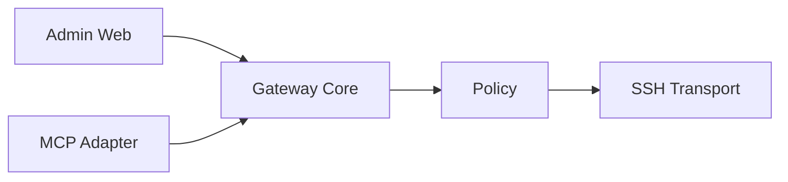

Está prohibido introducir rutas de ejecución paralelas como:

```text
Admin Web → SSH directo
Go MCP Adapter → SSH directo
```

### 3.4 Deny by default

Todo lo que no esté autorizado explícitamente se rechaza.

### 3.5 Least privilege

Runtime habitual:

```text
mcp-gateway
sin sudo
```

Los privilegios administrativos se reservan para instalación y mantenimiento controlado.

### 3.6 Shell completo solo con autorización explícita

`run_command` es un **trusted administrative Target shell**. Está activo únicamente cuando `shell_enabled=true` y el cliente tiene un grant que incluya `target_shell`, `run_command`, `execute`, `environment_management`, `system_package_management` o `*`. La herramienta:

- usa el Project autorizado como scope de autorización, auditoría y `cwd` inicial;
- **no** promete confinar los efectos del shell al Project; comandos de confianza pueden operar en las ubicaciones que permita la cuenta remota;
- preserva el entorno real del Target cuando corresponde;
- registra auditoría fail-closed antes de operaciones críticas;
- sigue sujeta a `gateway_enabled`, Target/Project habilitados, `shell_enabled` y grants del cliente.

Para trabajo repetible debe preferirse `run_task`, que permanece allowlisted por `argv`, `cwd`, timeout y estado enabled.

Las herramientas estructuradas de filesystem (`write_file`, `append_file`, `delete_file`, `copy_file`, `move_file`, `mkdir`) permanecen además sujetas a `writes_enabled` y `project.write`. `run_command` es una capacidad de ejecución separada: apagar el switch de structured writes no revoca por sí solo un grant de ejecución.

### 3.7 Una capa por actualización

Nunca actualizar varias capas críticas al mismo tiempo.

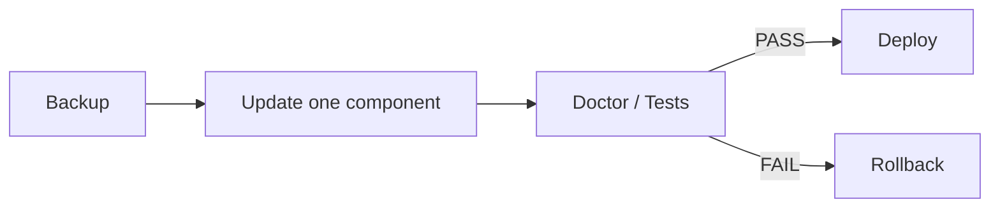

## 4. Arquitectura actual

### 4.1 Flujo MCP

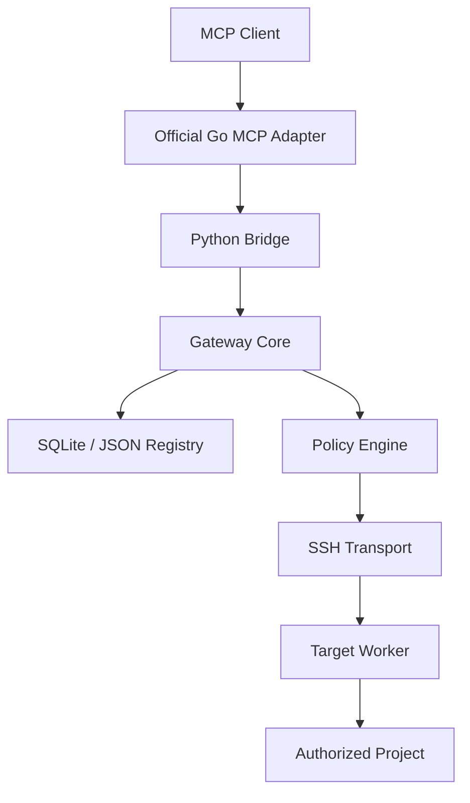

### 4.2 Flujo administrativo

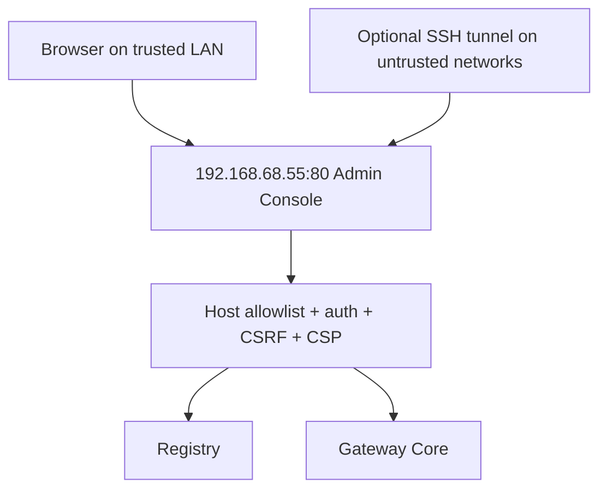

La consola administrativa está expuesta únicamente en la LAN confiable del MCP-Pi y valida un allowlist explícito de `Host`. El adaptador MCP continúa estrictamente en loopback (`127.0.0.1:8090`) y solo sale mediante Secure MCP Tunnel.

## 5. Componentes

### 5.1 Gateway Core

Runtime:

```text
Python >= 3.9 (runtime de producción en Trixie: 3.13.5; histórico Bullseye: 3.9.2)
```

Responsabilidades:

- resolución de Target y Project;
- policy enforcement;
- deny-by-default;
- canonical paths;
- protección contra path traversal;
- protección contra symlink escape;
- allowlist de tareas;
- timeouts;
- límites de salida;
- estado enabled/disabled de Targets y Projects;
- global kill switch;
- metadata de auditoría.

### 5.2 Registry

Backends:

```text
SQLiteRegistry — principal
JsonRegistry   — bootstrap / fallback / rollback
```

Schema actual:

```text
PRAGMA user_version = 1
```

Entidades:

```text
targets
projects
ai_clients
grants
activity
settings
admin_users
```

Nunca almacenar en el Registry:

- claves privadas SSH;
- contraseñas externas;
- cookies;
- sesiones del navegador;
- contraseñas de ChatGPT o Gemini;
- el secreto de sesión de Admin.

### 5.3 Admin Console

Stack:

```text
Flask 1.1.2
Jinja2 2.11.3
SQLite
Tailwind CSS precompilado
```

Servicio:

```text
mcp-gateway-admin.service
192.168.68.55:80
User=mcp-gateway
Host allowlist: 127.0.0.1, localhost, 192.168.68.55, mcp-pi
```

Acceso habitual en la LAN confiable:

```text
http://192.168.68.55
```

En una red no confiable puede mantenerse el patrón SSH tunnel hacia el mismo servicio.

Controles existentes:

- autenticación local de administrador;
- password hashing;
- cookies `HttpOnly`;
- `SameSite=Strict`;
- CSRF;
- CSP y security headers;
- rate limiting de login;
- debug deshabilitado;
- bind IPv4 `0.0.0.0:80` en producción, con Host allowlist explícita y `CAP_NET_BIND_SERVICE` únicamente.

### 5.4 MCP Adapter

SDK:

```text
github.com/modelcontextprotocol/go-sdk v1.7.0
```

Protocolos soportados por esta versión:

```text
2026-07-28
2025-11-25
2025-06-18
2025-03-26
2024-11-05
```

Build target:

```text
GOOS=linux
GOARCH=arm
GOARM=6
CGO_ENABLED=0
```

Binario observado:

```text
~8.38 MiB
```

Servicio:

```text
mcp-gateway-mcp.service
127.0.0.1:8090/mcp
User=mcp-gateway
```

El Go Adapter solo:

- habla MCP;
- expone schemas;
- gestiona el transport;
- serializa y deserializa.

No realiza:

- SSH;
- path policy;
- target policy;
- project policy;
- decisiones de autorización.

## 6. Catálogo de herramientas y capacidades

El catálogo vigente (`Tool Catalog v3`) expone **21 herramientas deterministas**. La visibilidad real por cliente depende de sus grants.

### 6.1 Herramientas Core / Targets (16)

| Tool | Capacidad principal | Riesgo |
| --- | --- | --- |
| `health` | health/read | Bajo |
| `list_targets` | read | Bajo |
| `target_status` | read | Bajo |
| `list_directory` | read | Bajo |
| `file_stat` | read | Bajo |
| `read_file` | read | Medio |
| `git_status` | read | Bajo |
| `search` | read | Medio |
| `run_task` | execute allowlisted task | Medio |
| `run_command` | execute / environment management | Alto |
| `write_file` | structured write | Alto |
| `append_file` | structured write | Alto |
| `delete_file` | structured write | Alto |
| `copy_file` | structured write | Alto |
| `move_file` | structured write | Alto |
| `mkdir` | structured write | Alto |

`run_task` acepta únicamente tareas declaradas y es la vía preferida para operaciones repetibles. `run_command` requiere autorización explícita de Target shell; el Project aporta scope/cwd inicial, pero no convierte el shell en un sandbox.

### 6.2 Herramientas de administración del Appliance (5)

| Tool | Estado | Riesgo |
| --- | --- | --- |
| `gateway_status` | ACTIVA | Bajo |
| `gateway_doctor` | ACTIVA | Bajo |
| `gateway_backup` | ACTIVA | Medio |
| `gateway_maintenance` | ACTIVA | Medio |
| `gateway_reboot` | ACTIVA | Alto |

`gateway_reboot` requiere confirmación explícita y usa el helper controlado del appliance.

`apply_patch` **no forma parte del catálogo vigente**; la edición estructurada usa las herramientas de filesystem y la edición avanzada puede hacerse mediante `run_command` cuando el cliente dispone del grant correspondiente.

### 6.3 Política de escritura controlada

La escritura exige simultáneamente:

```text
gateway_enabled
AND
target.enabled
AND
project.enabled
AND
client grant/capability
AND
project/path scope

# additional conditions for structured filesystem mutations:
AND writes_enabled
AND project.write
```

La configuración global de seguridad parte de:

```text
writes_enabled = false
```

### 6.4 `write_file`

`write_file` está implementada y validada con:

- rutas relativas;
- texto UTF-8 únicamente;
- `max_write_bytes` de 256 KiB por defecto;
- `expected_sha256` obligatorio para overwrite;
- semántica explícita de create/overwrite;
- dry-run;
- preview mediante unified diff;
- validación canónica del parent;
- denegación de symlink en destino o ancestros;
- reemplazo atómico;
- preservación de modo POSIX cuando aplica;
- backup local rotatorio;
- metadata de auditoría;
- prueba de recuperación.

#### Optimistic concurrency

Todo overwrite requiere:

```text
expected_sha256
```

Si el contenido cambió, la operación devuelve:

```text
WRITE_CONFLICT
```

#### Atomic write

Secuencia implementada:

```text
temporary file in same directory
→ write
→ flush
→ fsync
→ preserve mode
→ os.replace
→ fsync directory
→ cleanup
```

#### Backups de archivo

Ubicación conceptual:

```text
~/.local/share/mcp-gateway/backups/
```

Retención:

```text
hasta 5 versiones históricas por archivo
```

Los backups permanecen fuera del Target Worker.

#### Panic switch

Admin Console:

```text
Disable Controlled Writes
```

Efecto:

```text
read_file  → sigue funcionando
write_file → WRITES_DISABLED
```

### 6.3 `apply_patch`

Estado:

```text
DEFERRED_FOR_SAFE_IMPLEMENTATION
```

Decisión KISS: `read_file` + SHA-256 + `write_file` seguro cubren edición controlada sin introducir un parser de patch frágil.

### 6.4 Operaciones fuera de v1

- delete;
- arbitrary rename;
- binary mutation;
- chmod/chown;
- symlink creation;
- arbitrary shell.

## 7. Modelo de seguridad

### 7.1 Capas de control

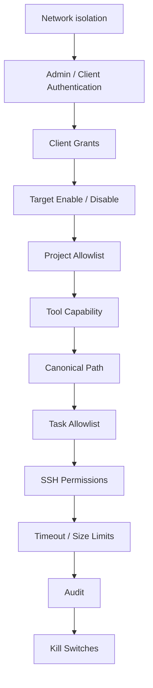

### 7.2 E2E negativo confirmado

Casos bloqueados:

1. path traversal;
2. absolute path;
3. unknown target;
4. unknown project;
5. unauthorized task;
6. symlink escape;
7. disabled target;
8. global kill switch.

Resultado documental canónico:

```text
Negative / control E2E: 8/8 DENIED
```

### 7.3 Visibilidad y capacidad

La misma decisión de autorización debe gobernar:

```text
tools/list
AND
tools/call
```

Una Tool que un cliente no puede ver tampoco puede ejecutarse manualmente fuera de esa autorización.

Modelo simplificado:

```text
Visibility: qué Target/Project puede ver
Capability: qué puede hacer
```

No introducir en v1:

- OPA;
- Cedar;
- enterprise teams;
- jerarquías de organización.

## 8. MCP, contratos y seguridad HTTP

### 8.1 MCP 2026-07-28

La documentación del proyecto registra para la revisión 2026-07-28:

- stateless protocol core;
- `server/discover`;
- per-request metadata;
- header-based routing;
- cacheable list results;
- Multi Round-Trip Requests;
- authorization hardening;
- formal extensions.

El soporte no se considera válido solo porque el SDK lo declare: debe estar cubierto por pruebas nativas.

### 8.2 Streamable HTTP

Para servir 2026-07-28 mediante el Go SDK se validó explícitamente:

```text
Stateless = true
```

### 8.3 Host, Origin y exposición

Controles requeridos y validados para el endpoint local:

- bind a `127.0.0.1`;
- validación de `Host`;
- validación explícita de `Origin`;
- rechazo de origen inválido con 403;
- pruebas de resistencia a DNS rebinding;
- límite explícito de body HTTP;
- autenticación obligatoria si el endpoint deja de ser exclusivamente local.

En Go SDK v1.7.0, el proyecto documenta que la protección localhost/Host existe y que `CrossOriginProtection == nil` no activa por defecto la validación cross-origin. Por ello la validación de Origin se habilita y prueba explícitamente.

### 8.4 Versionado de contratos

Contratos versionados:

```text
GATEWAY_VERSION
CORE_API_VERSION
BRIDGE_API_VERSION
TOOL_CATALOG_VERSION
REGISTRY_SCHEMA_VERSION
```

Archivo de compatibilidad:

```text
compatibility.json
```

Ejemplo de contrato:

```json
{
  "gateway": "0.5.0",
  "core_api": 1,
  "bridge_api": 1,
  "tool_catalog": 1,
  "registry_schema": 1,
  "mcp": {
    "sdk": "go-sdk",
    "sdk_version": "1.7.0",
    "protocol": "2026-07-28"
  }
}
```

> **Regla:** el Adapter debe fallar cerrado si el Bridge API no es compatible.

### 8.5 Health model

Endpoints:

```text
/live
/ready
/health
```

`/live` indica si el proceso está vivo y no toca Targets.

`/ready` verifica:

- Registry;
- schema;
- Core;
- Bridge contract;
- MCP Adapter readiness.

`/health` resume:

- version;
- services;
- DB;
- MCP;
- targets summary;
- compatibility.

### 8.6 Request IDs

Cada solicitud obtiene un `request_id`, propagado extremo a extremo:

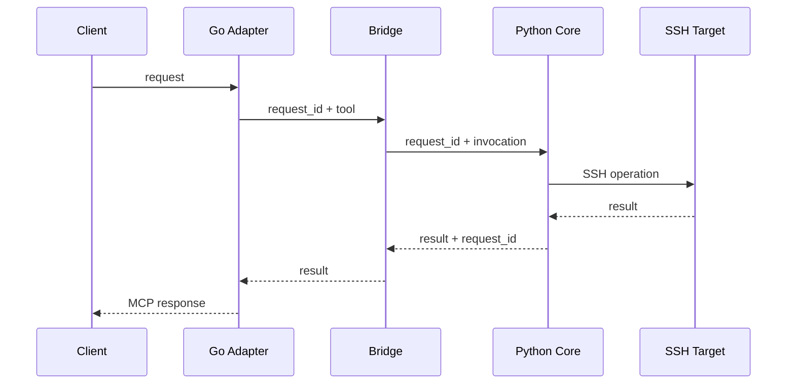

No instalar OpenTelemetry, Prometheus ni Grafana en v1.

## 9. Lifecycle y operación

### 9.1 CLI objetivo

```bash
mcp-gateway status
mcp-gateway setup
mcp-gateway doctor
mcp-gateway backup
mcp-gateway restore
mcp-gateway update
mcp-gateway rollback
mcp-gateway repair
mcp-gateway uninstall
mcp-gateway uninstall --purge
```

El usuario normal no debe definir `PYTHONPATH` para operar el appliance.

### 9.2 Release layout

Layout preferido:

```text
/opt/mcp-gateway/
├── releases/
│   ├── 0.5.0/
│   └── 0.5.1/
├── current -> releases/0.5.1
├── previous -> releases/0.5.0
└── bin/
    └── mcp-gateway
```

Persistencia:

```text
/var/lib/mcp-gateway/
├── gateway.db
└── backups/

/etc/mcp-gateway/
└── config
```

Si `/opt` y `/var` complican innecesariamente Bullseye/ARMv6, se permite una estructura equivalente dentro de `/home/mcp-gateway`.

La separación obligatoria es:

```text
APPLICATION != DATA != CONFIG != SECRETS != BACKUPS
```

### 9.3 Installer

`install.sh` debe ser idempotente.

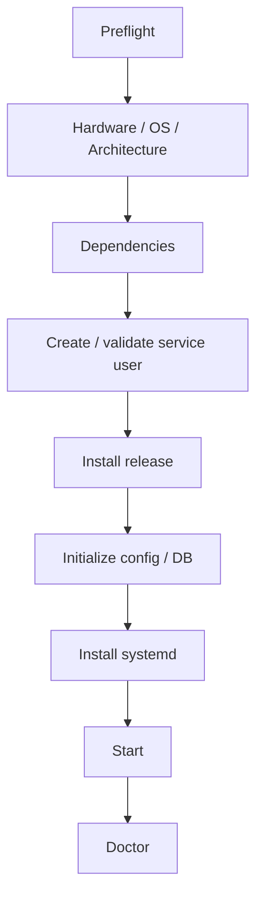

### 9.4 Setup

```bash
mcp-gateway setup
```

Wizard corto:

1. Admin password;
2. Gateway name;
3. SSH identity;
4. first Target;
5. first Project;
6. Doctor.

Debe permitir `Skip` cuando corresponda.

### 9.5 Doctor

```bash
mcp-gateway doctor
mcp-gateway doctor --verbose
```

Comprueba:

- instalación;
- versión;
- contratos;
- DB y schema;
- integridad SQLite;
- permisos de secretos;
- systemd;
- Admin;
- MCP;
- Bridge;
- Core;
- conectividad opcional a Targets;
- Tool Catalog;
- security gates.

`doctor` diagnostica y no realiza modificaciones destructivas.

### 9.6 Repair

```bash
mcp-gateway repair
```

Solo corrige drift conocido y seguro:

- permisos conocidos;
- symlinks de release;
- definiciones systemd;
- modos de archivos secretos;
- safe drift reconocido.

Nunca debe modificar:

- versión del OS;
- Wi-Fi;
- paquetes arbitrarios;
- Targets.

### 9.7 Backup y restore

Backup:

- usa la API de backup de SQLite;
- genera export saneado JSON.

Restore:

1. valida el backup;
2. comprueba schema;
3. detiene únicamente el servicio necesario;
4. restaura;
5. ejecuta `doctor`.

### 9.8 Update

No existe auto-update.

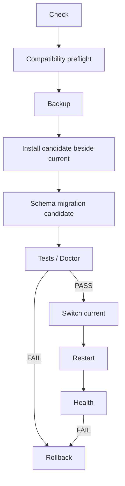

### 9.9 Rollback

```bash
mcp-gateway rollback
```

Debe conocer y validar:

```text
current
previous
schema compatibility
```

### 9.10 Uninstall

Normal:

```bash
mcp-gateway uninstall
```

Elimina:

- services;
- application releases;
- CLI.

Conserva:

- DB;
- config;
- SSH identities;
- backups.

Purga:

```bash
mcp-gateway uninstall --purge
```

La purga requiere confirmación fuerte.

### 9.11 Release manifest

Cada release incluye:

```text
manifest.json
SHA256SUMS
```

El manifest registra:

- version;
- architecture;
- Core API;
- Bridge API;
- Tool Catalog;
- schema range;
- MCP SDK;
- MCP protocol;
- minimum Python;
- checksums.

SBOM se recomienda más adelante en build, no en runtime.

### 9.12 Maintenance UI

Sección:

```text
Maintenance
├── Health
├── Versions
├── Compatibility
├── Backups
├── Updates
├── Rollback
└── Diagnostics
```

No agregar una acción genérica tipo:

```text
Update Everything
```

HTMX está aprobado únicamente como mejora pequeña para acciones puntuales. Debe estar vendorizado localmente, sin CDN, sin SPA y sin Node runtime.

## 10. Clientes de IA y grants

Estado:

```text
Phase 6A: PASS — Local Clients & Grants
Phase 6B: GATED — Cloud AI Clients
```

Implementado en 6A:

- `ai_clients` y `grants` en SQLite/JSON;
- precedencia fail-closed;
- host key pinning estricto con `StrictHostKeyChecking=yes`;
- protocolo MCP unificado en el SDK Go oficial;
- compatibilidad probada con Gemini CLI, Claude Desktop y Antigravity.

Modelo:

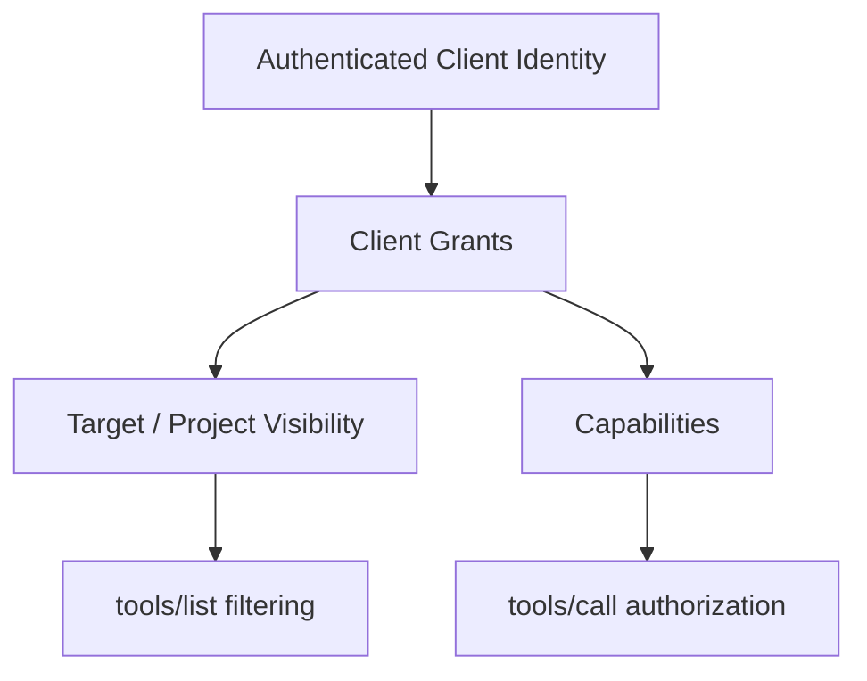

### 10.1 Ejemplo de autorización

```text
ChatGPT Main
→ DealHunter
→ read + task + write

Gemini ReadOnly
→ DealHunter
→ read only
```

### 10.2 Credenciales externas

Nunca almacenar:

- cookies de navegador de ChatGPT;
- cookies de Google;
- contraseñas externas.

### 10.3 ChatGPT y clientes cloud

Históricamente, v1.0.1 registró la restricción de que ChatGPT no conecta directamente a un MCP puramente local sin un túnel de retransmisión autenticado. Esta integración fue completada y validada en v1.2.1:

- Se cross-compiló e integró el cliente oficial **Secure MCP Tunnel** (`openai/tunnel-client` commit `3b706ea54d0ad303c85d5ccd35633ae69405570b`) para ARMv6.
- Opera como servicio systemd en `127.0.0.1:8091` sin abrir puertos de entrada en el router ni exponer MCP-Pi a Internet.
- Se demostró la aceptación E2E con ChatGPT Plus en espacio personal (Developer Mode), ejecutando llamadas a herramientas de forma completamente autónoma contra MCP-Pi.

> **No exponer MCP-Pi públicamente a Internet bajo ninguna circunstancia.**

### 10.4 Otros clientes

Claude, Gemini, Cursor, VS Code u otros clientes deben integrarse mediante adaptadores/configuración de cliente sin modificar el Core.

CLI futuro de onboarding:

```bash
mcp-gateway client configure <client>
mcp-gateway client configure <client> --dry-run
mcp-gateway client rollback <client>
```

Secuencia obligatoria:

```text
detect
→ backup
→ preview
→ apply
→ verify
```

## 11. Resiliencia y estrategia de OS

### 11.1 Modernización de OS completada (Phase 8)

Debian 11 Bullseye alcanzó el final de LTS el **31 de agosto de 2026**. Esta deuda técnica fue resuelta formalmente en **Phase 8 (OS Modernization)**:

- Se realizó una migración física y limpia hacia **Raspberry Pi OS / Debian 13 Trixie (32-bit `armv6l`)**.
- Tras superar todos los gates funcionales, conectividad Wi-Fi (RTL8188EUS), restauración de identidad SSH histórica, validación de regresión completa y soak test de 60 minutos, Trixie fue promovido como baseline de producción.
- La microSD original de Bullseye permanece intacta y preservada como rollback físico garantizado (`KNOWN_GOOD`).

### 11.2 Estrategia de migración

La ruta preferida es una migración física y reversible sobre una microSD nueva o clonada:

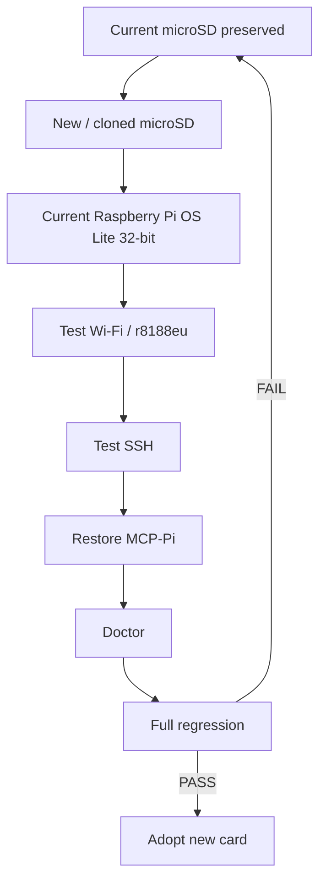

La microSD actual se conserva como rollback físico.

Phase 7A está completada como preparación y resiliencia; la migración física de Phase 7B permanece postpuesta para post-v1.

### 11.3 Cadencia operativa

| Frecuencia | Actividad |
| --- | --- |
| Semanal | Doctor corto + backup |
| Mensual | Revisar updates, logs, disco y RAM |
| Trimestral | Revisar claves, probar restore y revocación |
| Antes de update | Backup + compatibility preflight |
| Después de update | Full doctor + regression |

No actualizar automáticamente.

## 12. Extensión futura: Services

Después de v1, y solo si aparece una necesidad real, `Services` representará servidores MCP externos.

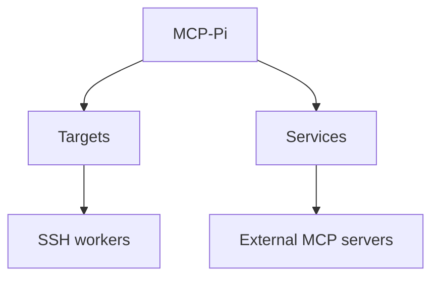

Regla conceptual:

```text
Target != Service
```

- Un **Target** es una máquina/workspace.
- Un **Service** ya habla MCP.

El Official MCP Registry puede evaluarse como catálogo de descubrimiento de Services, no como reemplazo del modelo de Targets.

## 13. Integraciones deliberadamente excluidas

No incorporar por ahora:

- ContextForge completo;
- ToolHive completo;
- Docker;
- Kubernetes;
- Redis;
- PostgreSQL;
- OPA;
- Cedar;
- Prometheus;
- Grafana;
- OpenTelemetry Collector;
- React;
- Vue;
- Angular;
- Node runtime en la Pi;
- Code Mode / meta-tools;
- job system propio.

Reconsiderar únicamente ante una necesidad medible.

### 13.1 Patrones del ecosistema que sí se reutilizan

Se reutilizan patrones maduros sin adoptar plataformas completas:

- Tool visibility + tool call enforcement con una misma decisión de autorización;
- separación de Visibility y Capability;
- HTMX local para interacciones puntuales;
- Official MCP SDK para protocolo y transport;
- Official MCP Registry, eventualmente, como fuente de descubrimiento para Services.

El diferenciador de MCP-Pi se mantiene:

```text
AI Client
→ MCP-Pi
→ Target
→ Project
→ SSH Worker
```

## 14. Riesgos y deuda técnica

| Riesgo | Estado actual | Mitigación |
| --- | --- | --- |
| Bullseye EOL | RESUELTO / MITIGADO | Phase 8 completada; producción en Debian 13 Trixie, microSD Bullseye como rollback físico |
| ARMv6 | CONTROLADO | Cross-build + releases fijadas |
| ~173 MiB RAM | CONTROLADO | Servicios actuales por debajo de ~25 MiB según la evidencia del proyecto |
| Wi-Fi USB único | CONTROLADO | Evitar upgrades de OS improvisados |
| Prompt injection | CONTROLADO | Narrow tools + Core policy |
| Cambios de MCP | CONTROLADO | SDK oficial + contratos versionados |
| Migración de DB | CONTROLADO | Manifest + schema gate + backup |
| Incompatibilidad de update | CONTROLADO | Doctor + rollback |
| Ataques Host/Origin/DNS rebinding | CONTROLADO | Bind local + validaciones y regresión E2E |
| Escrituras concurrentes | CONTROLADO | `expected_sha256` + atomic write |
| Suplantación de cliente | CONTROLADO | Identidad autenticada + grants; token pinning en Secure MCP Tunnel |
| Conectividad con clientes cloud | RESUELTO / MITIGADO | Secure MCP Tunnel oficial autenticado integrado en v1.2.1 |

## 15. ADR — decisiones consolidadas

| ADR | Decisión | Estado |
| --- | --- | --- |
| ADR-001 | Raspberry Pi A+ se mantiene | ACCEPTED |
| ADR-002 | Pi-hole separado | ACCEPTED |
| ADR-003 | CLI / minimal OS | ACCEPTED |
| ADR-004 | No Docker inicialmente | ACCEPTED |
| ADR-005 | Los Targets hacen el trabajo pesado | ACCEPTED |
| ADR-006 | SSH como transporte principal a Targets | ACCEPTED |
| ADR-007 | `run_command` permitido solo por grant explícito, Project scope y auditoría | SUPERSEDED / ACCEPTED CURRENT |
| ADR-008 | AI-client agnostic | ACCEPTED |
| ADR-009 | Multi-target | ACCEPTED |
| ADR-010 | Multi-project | ACCEPTED |
| ADR-011 | Admin Console local | ACCEPTED |
| ADR-012 | SQLite principal / JSON fallback | ACCEPTED |
| ADR-013 | Tailwind precompilado | ACCEPTED |
| ADR-014 | Single Core | ACCEPTED |
| ADR-015 | Localhost-first | ACCEPTED |
| ADR-016 | Official MCP SDK | ACCEPTED |
| ADR-017 | Go Adapter + Python Core | ACCEPTED |
| ADR-018 | Compatibility before writes | ACCEPTED |
| ADR-019 | Versioned lifecycle | ACCEPTED |
| ADR-020 | No auto-update | ACCEPTED |
| ADR-021 | Reuse-first ecosystem policy | ACCEPTED |
| ADR-022 | Services opcionales y separados de Targets | ACCEPTED |

## 16. Evidencia y Definition of Done

### 16.1 Evidencia de Controlled Write

```text
Phase 5 commit: 1147017
Tag: phase-5-pass
Python tests: 88 / 88 PASS
Go tests: 4 / 4 PASS
Controlled Write E2E: 19 / 19 PASS
MCP tools: 9
write_file: PASS
apply_patch: DEFERRED_FOR_SAFE_IMPLEMENTATION
Pi-hole: UNCHANGED
```

### 16.2 Definition of Done v1.0

MCP-Pi v1.0 se considera completado y verificado con:

```text
[x] Phase 4D PASS
[x] Compatibility contracts versioned
[x] Doctor / repair / lifecycle complete
[x] Installation reproducible
[x] Update + rollback proven
[x] Backup + restore proven
[x] Uninstall + purge proven
[x] Controlled write (write_file) implemented and validated
[x] expected SHA-256
[x] atomic write
[x] write kill switch
[x] recovery test
[x] apply_patch deferred by design for determinism and KISS
[x] At least one authenticated AI/MCP client integrated
[x] Client grants enforce tools/list and tools/call
[x] Client credentials not stored unsafely
[x] At least one real Target Worker validated
[x] Multi-project validated
[x] Target/project disable validated
[x] Global kill switch validated
[x] Origin / Host / DNS rebinding tests PASS
[x] MCP native conformance PASS (MCP 2026-07-28 / Go SDK v1.7.0)
[x] Negative security suite PASS (8/8 denied fail-closed)
[x] OS migration and rollback plan prepared and validated in Phase 7A
[x] Physical OS migration deferred to Phase 7B post-v1
[x] Recovery path documented and tested (microSD swap, vault backup, rollback)
[x] Documentation current
```

### 16.3 Phase 4D — cierre consolidado

Phase 4D quedó completada con:

- `compatibility.json` y contratos versionados;
- adapter/bridge mismatch fail-closed;
- conformance nativa MCP 2026-07-28;
- Streamable HTTP con `Stateless=true`;
- validaciones Host y Origin;
- regresión de DNS rebinding;
- request size limit;
- orden determinista de `tools/list`;
- seam común de autorización para list/call;
- `/live`, `/ready`, `/health`;
- propagación de `request_id`;
- `doctor`, `repair`, `backup`, `restore`;
- release manifest y checksums;
- layout versionado;
- update, rollback, uninstall y purge;
- Maintenance page;
- HTMX local cuando aporta valor;
- no auto-update;
- secretos fuera de Git;
- documentación y runbooks actualizados.

## 17. Estado resumido de producción (1.3.0)

```text
PROJECT: Local-miniMCP / MCP-Pi Gateway
DOCUMENT: 1.3.0 current develop/production baseline (2026-09-14); latest immutable tag: v1.2.1
CURRENT STATE: OPERATIONAL / REMOTE_AUTONOMY_ENABLED

GATEWAY:
  MCP-Pi
  192.168.68.55
  Raspberry Pi Model A+ Rev 1.1
  ARMv6 / Debian 13 Trixie

ADMIN:
  http://192.168.68.55
  Flask + Jinja + precompiled Tailwind
  Host allowlist + authentication + CSRF + CSP

MCP:
  Official Go SDK v1.7.0
  127.0.0.1:8090/mcp (loopback only)
  Protocol: 2026-07-28
  Secure MCP Tunnel to OpenAI

TOOLS:
  21 deterministic tools (Tool Catalog v3)
  16 Core/Target tools + 5 appliance admin tools
  run_command: TRUSTED TARGET SHELL when shell_enabled=true and explicitly granted

STRUCTURED WRITES:
  write_file, append_file, delete_file, copy_file, move_file, mkdir
  protected by writes_enabled + project.write + grants + path scope

EXECUTION:
  run_command is separate from the structured-write switch
  requires target_shell/run_command/execute/environment-management capability or *
  shell_enabled is the dedicated Target-shell kill switch

ACTIVE TARGET:
  termux-main / Android Termux / SSH :8022
  endpoint may change; SSH host key is canonical identity

KISS: MANDATORY
REUSE-FIRST: MANDATORY
```

### 17.1 Histórico: Estado al cierre de v1.0.1 (Bullseye)

```text
PROJECT: MCP-Pi Gateway
DOCUMENT: 1.0.1
RELEASE: v1.0.1 — Hygiene Patch Release
CURRENT STATE: OPERATIONAL_STABLE (Histórico 10-Sep-2026)
GATEWAY: MCP-Pi (192.168.68.85, Raspberry Pi Model A+ Rev 1.1, ARMv6 / 176 MiB RAM)
ACTIVE TARGET: termux-main (192.168.68.72:8022)
TOOLS: 9 active deterministic tools
OS: Raspbian 11 Bullseye — verified hardware baseline (physical OS migration deferred post-v1)
```

## 18. Referencias externas registradas para esta versión

Estas referencias incluyen la base histórica consolidada de v1.2.1 y el baseline CURRENT 1.3.0; deben revisarse de nuevo cuando cambie una fase que dependa de ellas:

- Model Context Protocol — Specification 2026-07-28.
- Official MCP Go SDK — compatibility matrix and v1.7.0 release notes.
- Official MCP Go SDK — Streamable HTTP / Origin and localhost protection.
- ToolHive — tool filtering and common admission/authorization seam.
- mcp-gway — local-first SSR dashboard, HTMX/Tailwind patterns.
- OpenAI Help Center — private/local MCP connectivity and Secure MCP Tunnel.
- Debian Project — Debian 11 Bullseye LTS end-of-life, 31 Aug 2026.
- Raspberry Pi — Raspberry Pi OS Lite 32-bit / Debian 13 compatibility.

> Estas referencias se conservan tal como están registradas en la documentación fuente. Una futura revisión técnica debe volver a verificarlas antes de tomar decisiones dependientes de ellas.

## 19. Regla para toda fase futura

Antes de iniciar una nueva fase:

```text
1. Read this master document.
2. Read AGENTS.md.
3. Read current project-state.md.
4. Run baseline regression.
5. Check ecosystem/official standards for reusable solutions.
6. Make the smallest change that satisfies the requirement.
7. Run positive + negative tests.
8. Measure resource impact.
9. Update documentation.
10. Create rollback point.
```

> **MCP-Pi debe crecer por composición de piezas pequeñas y estables, no por acumulación de frameworks.**

## 20. Corrección de roadmap consolidada

La secuencia histórica relevante queda:

```text
Phase 5 PASS
    ↓
Phase 4D hardening / lifecycle catch-up — PASS
    ↓
Phase 6A local client integration — PASS
    ↓
Phase 6B cloud client integration — GATED
    ↓
Phase 7B physical OS migration — DEFERRED POST-V1
```

No se adopta un túnel público genérico como parte de la arquitectura core.

Transportes por tipo de cliente:

```text
Claude Desktop / local clients
→ stdio or local/SSH-tunneled MCP

ChatGPT
→ Secure MCP Tunnel if supported/eligible; revalidate before use

Other clients
→ individually validated transport/auth
```
