# MCP-Pi Gateway — Documentación Maestra

### Gateway MCP local, ligero, multi-target, multi-project y agnóstico del cliente de IA

**Versión documental:** 0.7  
**Fecha de corte:** 9 de septiembre de 2026  
**Estado del proyecto:** **Phase 6A Closeout PASS (Official MCP Unification & Real Client Smoke)**  
**Siguiente fase oficial:** **Phase 6B — Cloud AI Clients & ChatGPT Integration Gate**  
**Principio rector:** **KISS — Keep It Simple, Stupid / “Mantenlo simple, estúpido”**  
**Política de construcción:** **Reuse first; build only what is specific to MCP-Pi**

> Este documento sustituye conceptualmente a la línea base v0.1 como fuente de verdad general del proyecto.  
> Los documentos por fase, runbooks, reportes y pruebas siguen siendo evidencia histórica y operativa.

## 1. Propósito

MCP-Pi busca convertir una **Raspberry Pi Model A+** en un appliance ligero que medie entre clientes de IA/MCP y dispositivos de una red privada.

La Raspberry Pi no ejecuta el trabajo pesado. Su función es:

> **autenticar + validar + autorizar + limitar + delegar + auditar**

Los dispositivos objetivo realizan el trabajo real:

- lectura de archivos;
- operaciones Git;
- tests;
- builds;
- búsquedas;
- herramientas del proyecto;
- futuras modificaciones controladas.

El proyecto debe mantenerse:

- sencillo;
- auditable;
- reversible;
- multi-target;
- multi-project;
- agnóstico del cliente de IA;
- deny-by-default;
- sin shell arbitrario;
- sin exposición pública por defecto;
- sin dependencias pesadas innecesarias.

## 2. Objetivo final

La versión 1.0 deberá permitir:

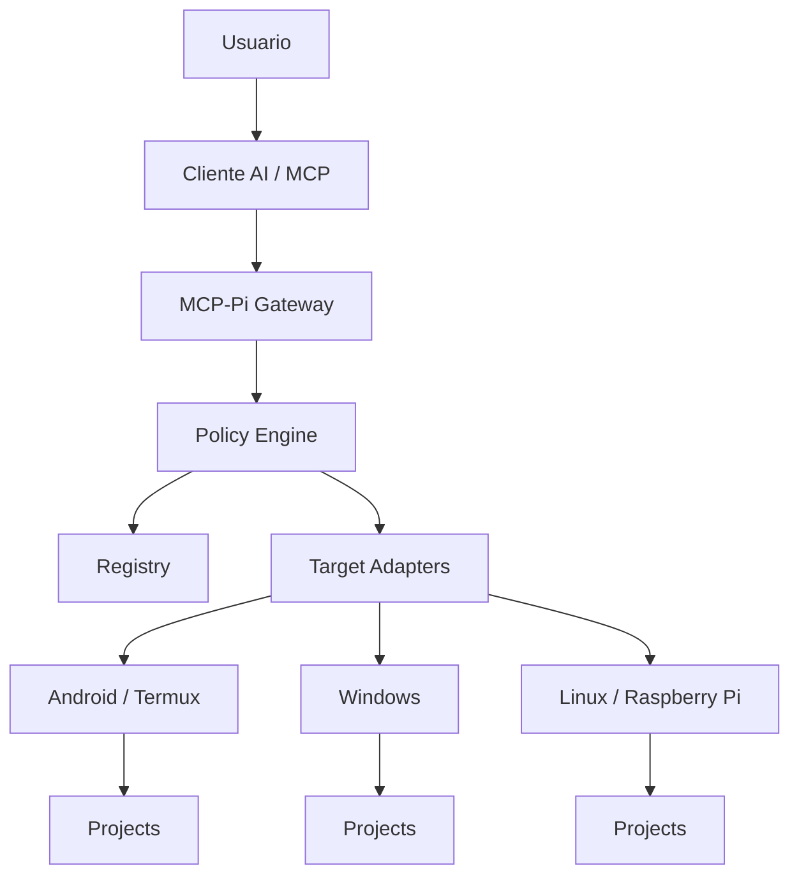

El usuario final deberá poder administrar de forma simple:

- Targets;
- Projects;
- AI Clients;
- Grants;
- Tools;
- Activity;
- Health;
- Compatibility;
- Backups;
- Updates;
- Rollback;
- Repair;
- Uninstall.

El usuario no debería necesitar recordar comandos internos, rutas de Python, SQL, ni detalles de systemd para las operaciones habituales.

## 3. Principios no negociables

### 3.1 KISS

Antes de añadir cualquier componente:

1. ¿Resuelve una necesidad real?
2. ¿Existe un estándar o SDK oficial?
3. ¿Existe un patrón maduro que podamos reutilizar?
4. ¿Añade una dependencia permanente?
5. ¿Duplica lógica?
6. ¿Puede probarse y revertirse?
7. ¿La Raspberry A+ puede ejecutarlo razonablemente?

Si una solución pequeña resuelve el problema, se prefiere sobre una plataforma compleja.

### 3.2 Reuse first

Orden de preferencia:

```text
estándar oficial
→ SDK oficial
→ herramienta del sistema
→ biblioteca pequeña y madura
→ patrón probado de otro proyecto
→ código propio
```

El código propio se reserva para lo específico de MCP-Pi:

- Target Registry;
- Project Registry;
- policy enforcement;
- SSH workers;
- grants;
- lifecycle adaptado al appliance.

### 3.3 Single Core

La Web y MCP usan exactamente el mismo Gateway Core.

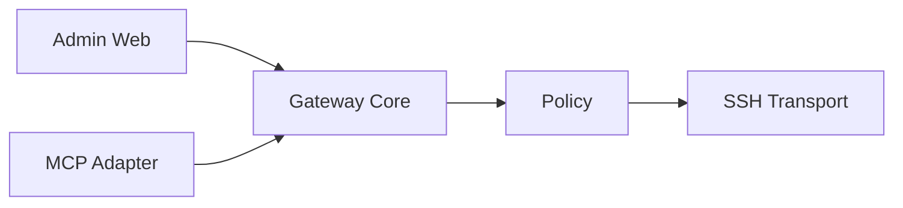

Está prohibido:

```text
Admin Web → SSH directo
Go MCP Adapter → SSH directo
```

### 3.4 Deny by default

Todo lo no autorizado explícitamente se rechaza.

### 3.5 Least privilege

Runtime habitual:

```text
mcp-gateway
sin sudo
```

Los privilegios administrativos se usan sólo para instalación y mantenimiento controlado.

### 3.6 No arbitrary shell

Fuera de v1:

- arbitrary shell;
- generic exec;
- generic PowerShell;
- generic Bash;
- unrestricted command execution.

### 3.7 Una capa por actualización

Nunca actualizar varias capas críticas al mismo tiempo.

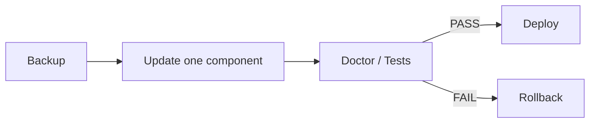

## 4. Estado real confirmado

### 4.1 MCP-Pi

```text
Hostname: MCP-Pi
LAN IP: 192.168.68.85
Hardware: Raspberry Pi Model A Plus Rev 1.1
Architecture: armv6l
RAM utilizable: ~176 MiB
OS actual: Raspbian / Debian 11 Bullseye
Python: 3.9.2
Runtime user: mcp-gateway (UID 1001)
Runtime sudo: NO
```

### 4.2 Pi-hole separado

```text
Hostname: YorPi
IP: 192.168.68.54
Rol: Pi-hole
```

Regla permanente:

> Nunca instalar MCP-Pi en YorPi ni mezclar la infraestructura DNS con este proyecto.

### 4.3 Primer Target Worker

```text
Target ID: termux-main
Host: 192.168.68.84
Port: 8022
User: u0_a435
Platform: Android / Termux
Transport: SSH Ed25519
```

Proyecto real validado:

```text
Project: MCP_Local
Root: /data/data/com.termux/files/home/Projects/test/MCP_Local
```

Limitación conocida:

Android/Termux usa el UID de la aplicación. El aislamiento POSIX independiente entre proyectos es limitado.

Mitigación:

```text
MCP-Pi
→ project roots
→ canonical path
→ capability policy
→ task allowlist
→ deny-by-default
```

## 5. Estado de fases

| Fase | Estado | Resultado |
|---|---|---|
| 0 | PASS | Línea base |
| 1 | PASS | Inventario, red y APT gate |
| 2A | PASS | Hostname, red y estabilidad |
| 2B | PASS | Usuario `mcp-gateway`, identidad SSH |
| 3 | PASS_WITH_PLATFORM_LIMITATION | Primer Target Worker |
| 4A | PASS | Gateway Core |
| 4B | PASS | Registry + SQLite + Admin Console |
| 4C | PASS | Adaptador MCP oficial |
| **4D** | **SIGUIENTE / OBLIGATORIA ANTES DE 6** | Compatibilidad, seguridad y lifecycle |
| **5** | **PASS** | Controlled Write seguro (`write_file`) |
| 6 | PENDIENTE | AI Clients, auth y grants |
| 7 | PENDIENTE | Resiliencia, OS migration y operación v1 |

## 6. Arquitectura actual

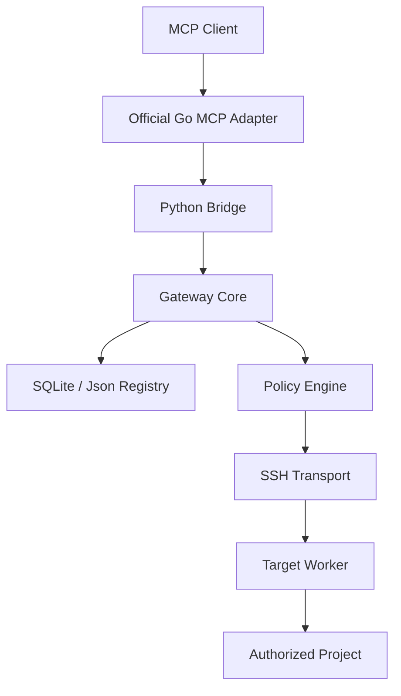

Admin:

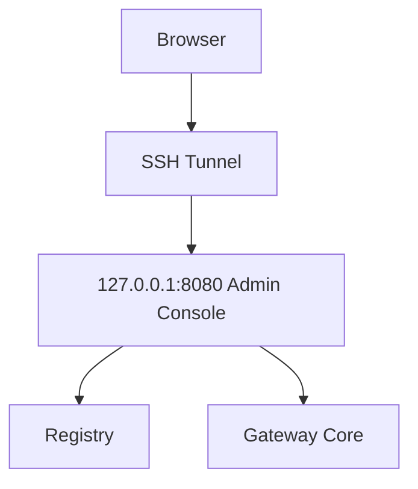

## 7. Componentes

### 7.1 Gateway Core

Lenguaje:

```text
Python 3.9.2
```

Responsabilidades:

- target/project resolution;
- policy enforcement;
- deny-by-default;
- canonical paths;
- traversal protection;
- symlink escape protection;
- tasks allowlist;
- timeouts;
- output limits;
- target/project enabled state;
- global kill switch;
- audit metadata.

### 7.2 Registry

Backends:

```text
SQLiteRegistry — principal
JsonRegistry   — bootstrap / fallback / rollback
```

Schema actual:

```text
PRAGMA user_version = 1
```

Entidades actuales:

```text
targets
projects
ai_clients
grants
activity
settings
admin_users
```

Nunca guardar:

- SSH private keys;
- passwords externos;
- cookies;
- browser sessions;
- ChatGPT passwords;
- Gemini passwords;
- Admin session secret.

### 7.3 Admin Console

Stack:

```text
Flask 1.1.2
Jinja2 2.11.3
SQLite
Tailwind CSS precompilado
```

Servicio:

```text
mcp-gateway-admin.service
127.0.0.1:8080
User=mcp-gateway
```

Acceso:

```bash
ssh -N -L 8080:127.0.0.1:8080 Yorologo@192.168.68.85
```

Seguridad existente:

- local admin auth;
- password hashing;
- HttpOnly;
- SameSite=Strict;
- CSRF;
- CSP y security headers;
- login rate limiting;
- no debug;
- localhost-only.

### 7.4 MCP Adapter

SDK:

```text
github.com/modelcontextprotocol/go-sdk v1.7.0
```

Protocolos soportados por esta versión:

```text
2026-07-28
2025-11-25
2025-06-18
2025-03-26
2024-11-05
```

Target build:

```text
GOOS=linux
GOARCH=arm
GOARM=6
CGO_ENABLED=0
```

Binario observado:

```text
~8.38 MiB
```

Servicio:

```text
mcp-gateway-mcp.service
127.0.0.1:8090/mcp
User=mcp-gateway
```

El Go Adapter sólo:

- habla MCP;
- expone schemas;
- maneja transport;
- serializa/deserializa.

No hace:

- SSH;
- path policy;
- target policy;
- project policy;
- authorization decisions.

## 8. Herramientas actuales

| Tool | Estado | Riesgo |
|---|---|---|
| `health` | ACTIVA | Bajo |
| `list_targets` | ACTIVA | Bajo |
| `target_status` | ACTIVA | Bajo |
| `list_directory` | ACTIVA | Bajo |
| `file_stat` | ACTIVA | Bajo |
| `read_file` | ACTIVA | Medio |
| `git_status` | ACTIVA | Bajo |
| `run_task` | ACTIVA | Medio |
| `write_file` | NO IMPLEMENTADA | Alto |
| `apply_patch` | NO IMPLEMENTADA | Alto |
| `delete_file` | FUERA DE V1 | Muy alto |
| arbitrary shell | FUERA DE V1 | Crítico |

`run_task` sólo acepta tareas declaradas.

## 9. Seguridad

### 9.1 Capas

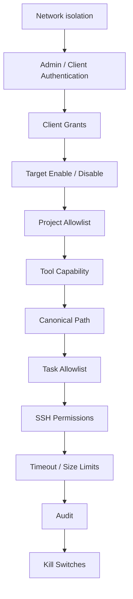

### 9.2 Seguridad E2E confirmada

Casos bloqueados:

1. path traversal;
2. absolute path;
3. unknown target;
4. unknown project;
5. unauthorized task;
6. symlink escape;
7. disabled target;
8. global kill switch.

La documentación general debe usar:

```text
Negative / control E2E: 8/8 DENIED
```

## 10. Decisiones basadas en el ecosistema

No sustituiremos MCP-Pi por plataformas generales como ContextForge o ToolHive.

Razón:

MCP-Pi tiene un diferenciador específico:

```text
AI Client
→ MCP-Pi
→ Target
→ Project
→ SSH Worker
```

Los gateways existentes se enfocan principalmente en federar servidores MCP existentes.

Sin embargo, reutilizaremos patrones maduros.

### 10.1 Tool visibility + tool call enforcement

Inspirado en ToolHive:

```text
tools/list
AND
tools/call
```

deben utilizar la misma decisión de autorización.

Una herramienta que un cliente no puede ver tampoco puede ejecutarse manualmente.

### 10.2 Visibility + Capability

Inspirado en ContextForge, simplificado:

```text
Visibility:
qué target/project puede ver

Capability:
qué puede hacer
```

No introducir:

- OPA;
- Cedar;
- enterprise teams;
- organization hierarchy.

### 10.3 HTMX

Aprobado como mejora pequeña.

Uso:

- Test Target;
- Enable / Disable;
- Run Doctor;
- status cards;
- Maintenance actions.

Condiciones:

```text
vendored locally
no CDN
no SPA
no Node runtime
```

### 10.4 Official MCP Registry

Futuro opcional.

Debe modelarse como:

```text
Services
```

no como Targets.

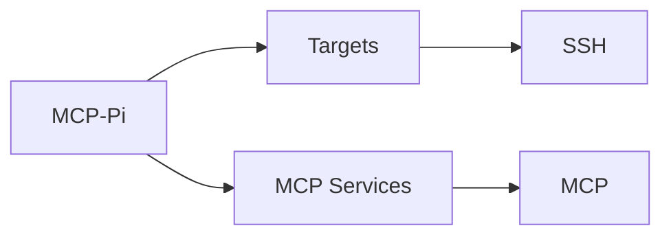

No es requisito de v1.0.

## 11. MCP 2026-07-28

La revisión 2026-07-28 introdujo:

- stateless protocol core;
- `server/discover`;
- per-request metadata;
- header-based routing;
- cacheable list results;
- Multi Round-Trip Requests;
- authorization hardening;
- formal extensions.

### 11.1 Requisito Phase 4D

No basta con “soportar” 2026-07-28 en el SDK.

Debe demostrarse con pruebas nativas.

### 11.2 Streamable HTTP

Para servir 2026-07-28 mediante el Go SDK:

```text
Stateless = true
```

debe validarse explícitamente.

### 11.3 Origin / Host

Requisito MCP:

- validar `Origin`;
- rechazar origen inválido con 403;
- bind local a `127.0.0.1`;
- implementar autenticación cuando el endpoint deje de ser exclusivamente local.

En Go SDK v1.7.0:

- la protección localhost/Host existe;
- `CrossOriginProtection == nil` no activa por defecto la validación cross-origin.

Phase 4D deberá activar/probar explícitamente ambas.

### 11.4 Request body limits

Mantener un límite explícito para requests MCP HTTP.

No deshabilitarlo.

## 12. Versionado de contratos

Phase 4D debe introducir:

```text
GATEWAY_VERSION
CORE_API_VERSION
BRIDGE_API_VERSION
TOOL_CATALOG_VERSION
REGISTRY_SCHEMA_VERSION
```

Archivo:

```text
compatibility.json
```

Ejemplo:

```json
{
  "gateway": "0.5.0",
  "core_api": 1,
  "bridge_api": 1,
  "tool_catalog": 1,
  "registry_schema": 1,
  "mcp": {
    "sdk": "go-sdk",
    "sdk_version": "1.7.0",
    "protocol": "2026-07-28"
  }
}
```

Regla:

> El Adapter debe fallar cerrado si el Bridge API no es compatible.

## 13. Health model

Introducir:

```text
/live
/ready
/health
```

### `/live`

¿Está vivo el proceso?

No toca targets.

### `/ready`

¿Está listo?

Comprueba:

- Registry;
- schema;
- Core;
- Bridge contract;
- MCP Adapter readiness.

### `/health`

Resumen operacional:

- version;
- services;
- DB;
- MCP;
- targets summary;
- compatibility.

## 14. Request IDs

Cada solicitud obtiene:

```text
request_id
```

Debe propagarse:

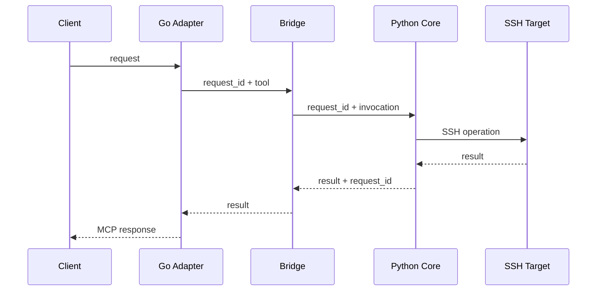

No instalar OpenTelemetry/Prometheus/Grafana en v1.

## 15. Phase 4D — Compatibility, Security & Lifecycle Foundation

**Estado:** SIGUIENTE  
**Obligatoria antes de Phase 6 / cualquier exposición a clientes externos**

> Controlled Write ya fue completado y validado en Phase 5. Phase 4D se ejecuta ahora como hardening, compatibilidad y lifecycle catch-up antes de conectar clientes externos.

### 15.1 Compatibility

Implementar:

- contract versions;
- `compatibility.json`;
- adapter/bridge startup gate;
- MCP native conformance;
- deterministic tool ordering;
- list/call authorization seam.

### 15.2 MCP HTTP security

Probar:

- bind = 127.0.0.1;
- Host validation;
- Origin validation;
- DNS rebinding resistance;
- request body limit;
- malformed requests;
- invalid Content-Type;
- invalid Accept;
- invalid protocol metadata.

### 15.3 Doctor

CLI:

```bash
mcp-gateway doctor
mcp-gateway doctor --verbose
```

Comprueba:

- installation;
- version;
- contracts;
- DB;
- schema;
- SQLite integrity;
- secret permissions;
- systemd;
- Admin;
- MCP;
- Bridge;
- Core;
- optional target connectivity;
- tool catalog;
- security gates.

Doctor diagnostica.

No modifica destructivamente.

### 15.4 Repair

```bash
mcp-gateway repair
```

Sólo corrige:

- known permissions;
- release symlinks;
- systemd definitions;
- secret file modes;
- known safe drift.

Nunca:

- OS upgrade;
- Wi-Fi;
- arbitrary package installation;
- target modification.

### 15.5 Lifecycle CLI

Objetivo UX:

```bash
mcp-gateway status
mcp-gateway setup
mcp-gateway doctor
mcp-gateway backup
mcp-gateway restore
mcp-gateway update
mcp-gateway rollback
mcp-gateway repair
mcp-gateway uninstall
mcp-gateway uninstall --purge
```

El usuario normal no debe tener que definir `PYTHONPATH`.

### 15.6 Release layout

Preferido:

```text
/opt/mcp-gateway/
├── releases/
│   ├── 0.5.0/
│   └── 0.5.1/
├── current -> releases/0.5.1
├── previous -> releases/0.5.0
└── bin/
    └── mcp-gateway
```

Persistencia:

```text
/var/lib/mcp-gateway/
├── gateway.db
└── backups/

/etc/mcp-gateway/
└── config
```

Si `/opt` y `/var` complican innecesariamente Bullseye/ARMv6, puede usarse una estructura equivalente dentro de `/home/mcp-gateway`.

Lo obligatorio es la separación:

```text
APPLICATION
!=
DATA
!=
CONFIG
!=
SECRETS
!=
BACKUPS
```

### 15.7 Installer

`install.sh` idempotente:

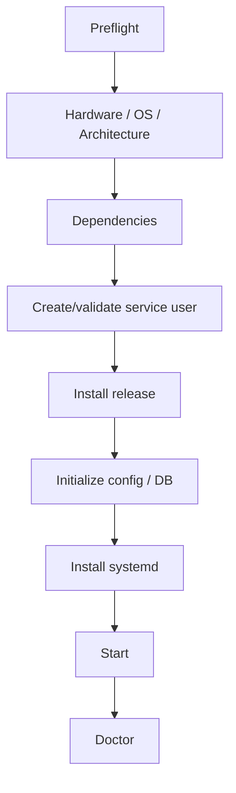

### 15.8 Setup

```bash
mcp-gateway setup
```

Wizard corto:

1. Admin password;
2. Gateway name;
3. SSH identity;
4. first target;
5. first project;
6. doctor.

Permitir Skip.

### 15.9 Update

No auto-update.

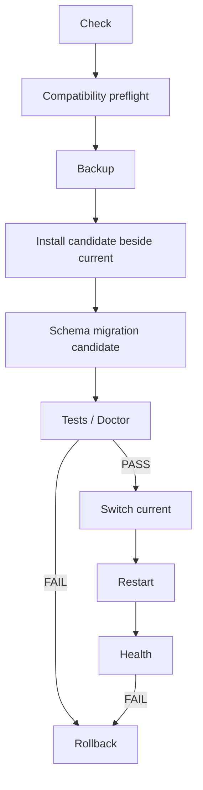

### 15.10 Rollback

```bash
mcp-gateway rollback
```

Debe conocer:

```text
current
previous
schema compatibility
```

### 15.11 Backup / Restore

Backup SQLite mediante API de backup.

Export saneado JSON.

Restore:

- validates backup;
- checks schema;
- stops only necessary service;
- restores;
- runs doctor.

### 15.12 Uninstall

Normal:

```bash
mcp-gateway uninstall
```

Elimina:

- services;
- application releases;
- CLI.

Conserva:

- DB;
- config;
- SSH identities;
- backups.

Purga:

```bash
mcp-gateway uninstall --purge
```

requiere confirmación fuerte.

### 15.13 Release manifest

Cada release:

```text
manifest.json
SHA256SUMS
```

Manifest:

- version;
- architecture;
- Core API;
- Bridge API;
- Tool Catalog;
- schema range;
- MCP SDK;
- MCP protocol;
- minimum Python;
- checksums.

SBOM:

recomendado más adelante en build, no en runtime.

### 15.14 Maintenance UI

Añadir sección:

```text
Maintenance
├── Health
├── Versions
├── Compatibility
├── Backups
├── Updates
├── Rollback
└── Diagnostics
```

No agregar:

```text
Update Everything
```

### 15.15 HTMX

Vendorear `htmx.min.js`.

Usar sólo para mejorar acciones puntuales.

## 16. Phase 4D — Definition of Done

Debe cumplir:

```text
[ ] Phase 4C regression PASS
[ ] Phase 5 regression PASS
[ ] `write_file` security E2E remains PASS
[ ] compatibility.json
[ ] contract versions
[ ] adapter/bridge mismatch FAIL-CLOSED
[ ] native MCP 2026-07-28 conformance
[ ] Streamable HTTP Stateless=true
[ ] Host validation tested
[ ] Origin validation explicitly enabled/tested
[ ] DNS rebinding regression tests
[ ] request size limit
[ ] deterministic tools/list
[ ] common authorization seam for list/call
[ ] /live
[ ] /ready
[ ] /health
[ ] request_id propagation
[ ] doctor
[ ] repair
[ ] backup
[ ] restore
[ ] release manifest
[ ] checksum verification
[ ] versioned release layout
[ ] update
[ ] rollback
[ ] uninstall
[ ] uninstall --purge
[ ] Maintenance page
[ ] HTMX local if useful
[ ] no auto-update
[ ] secrets outside Git
[ ] documentation/runbooks updated
```

## 17. Phase 5 — Controlled Write

**Estado: PASS**

Phase 5 fue completada antes de Phase 4D. No se rehace.  
Phase 4D pasa a ser el hardening/lifecycle gate obligatorio antes de exponer el gateway a clientes externos en Phase 6.

### 17.1 Política global

Implementado:

```text
writes_enabled = false
```

Default:

```text
OFF
```

Una escritura requiere:

```text
gateway_enabled
AND
writes_enabled
AND
target.enabled
AND
project.enabled
AND
project.write
AND
path policy
```

La autorización por cliente/grant se añadirá en Phase 6.

### 17.2 `write_file`

**IMPLEMENTADO Y VALIDADO**

Características:

- relative path;
- UTF-8 text only;
- `max_write_bytes` default 256 KiB;
- `expected_sha256` obligatorio para overwrite;
- create/overwrite semantics explícitas;
- dry-run;
- unified diff preview;
- canonical parent validation;
- symlink destination/ancestor denial;
- atomic replace;
- POSIX mode preservation cuando aplica;
- local rotating backup;
- audit metadata;
- recovery test.

### 17.3 Optimistic concurrency

Overwrite requiere:

```text
expected_sha256
```

Si cambió:

```text
WRITE_CONFLICT
```

Esto previene sobrescrituras obsoletas y pérdida silenciosa de cambios.

### 17.4 Atomic write

Implementado:

```text
temporary file in same directory
→ write
→ flush
→ fsync
→ preserve mode
→ os.replace
→ fsync directory
→ cleanup
```

### 17.5 Backups

Ubicación conceptual:

```text
~/.local/share/mcp-gateway/backups/
```

Retención:

```text
hasta 5 versiones históricas por archivo
```

Los backups permanecen fuera del Target Worker.

### 17.6 Panic switch

Admin Console:

```text
Disable Controlled Writes
```

Efecto:

```text
read_file → sigue funcionando
write_file → WRITES_DISABLED
```

### 17.7 `apply_patch`

Estado:

```text
DEFERRED_FOR_SAFE_IMPLEMENTATION
```

Decisión KISS:

`read_file` + SHA-256 + `write_file` seguro resuelven edición controlada sin introducir un parser de patch frágil.

### 17.8 Evidencia

```text
Python tests: 88 / 88 PASS
Go tests: 4 / 4 PASS
E2E Controlled Write: 19 / 19 PASS
MCP tools: 9
```

### 17.9 Fuera de v1

- delete;
- arbitrary rename;
- binary mutation;
- chmod/chown;
- symlink creation;
- arbitrary shell.

## 18. Phase 6 — AI Clients

Objetivo:

convertir `ai_clients` y `grants` en autorización real.

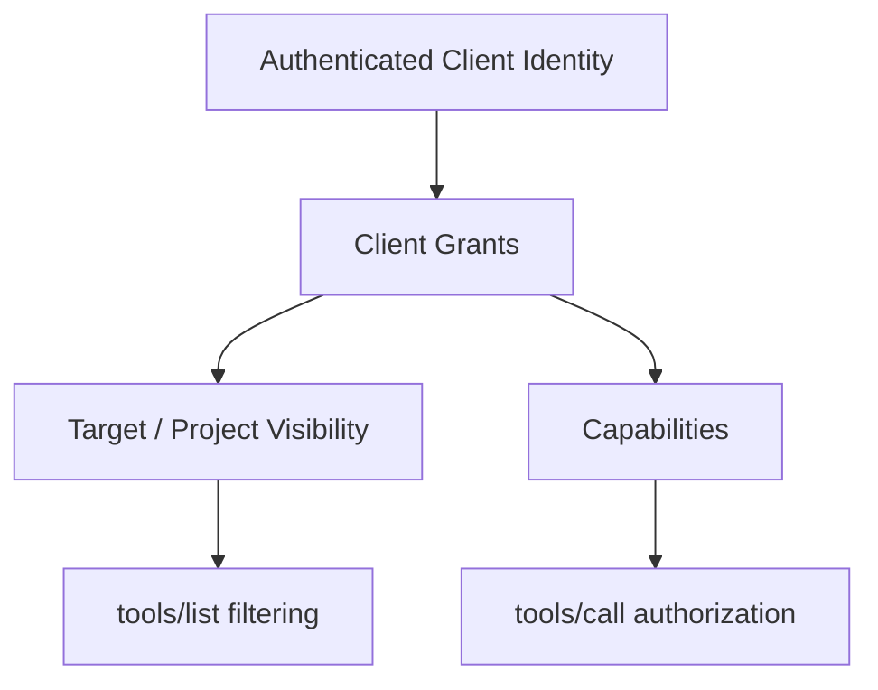

### 18.1 Same decision for list/call

La misma autorización controla:

```text
tools/list
tools/call
```

Nunca confiar en que ocultar una tool equivale a protegerla.

### 18.2 AI Client model

Ejemplo:

```text
ChatGPT Main
→ DealHunter
→ read + task + write

Gemini ReadOnly
→ DealHunter
→ read only
```

### 18.3 No browser credentials

Nunca almacenar:

- ChatGPT browser cookies;
- Google cookies;
- passwords externos.

### 18.4 ChatGPT

Estado actual externo:

ChatGPT no conecta directamente a un MCP puramente local.

Para infraestructura privada/on-premises deberá revalidarse **Secure MCP Tunnel** al llegar a Phase 6.

La disponibilidad y permisos dependen del producto/plan vigente y deben comprobarse de nuevo en esa fase.

No exponer MCP-Pi públicamente para evitar esta restricción.

### 18.5 Otros clientes

Claude, Gemini, Cursor, VS Code u otros:

se integran mediante adaptadores/configuración de cliente sin cambiar el Core.

### 18.6 Client onboarding

Futuro CLI:

```bash
mcp-gateway client configure <client>
mcp-gateway client configure <client> --dry-run
mcp-gateway client rollback <client>
```

Siempre:

```text
detect
→ backup
→ preview
→ apply
→ verify
```

## 19. Phase 7 — Resiliencia y operación v1

### 19.1 Debian 11

Debian 11 Bullseye llegó al final de LTS el 31 de agosto de 2026.

Esto convierte el OS actual en deuda técnica prioritaria.

NO hacer upgrade in-place improvisado.

### 19.2 Estrategia de migración

Raspberry Pi OS Lite 32-bit actual está basado en Debian 13 y se declara compatible con todos los modelos Raspberry Pi.

Ruta preferida:

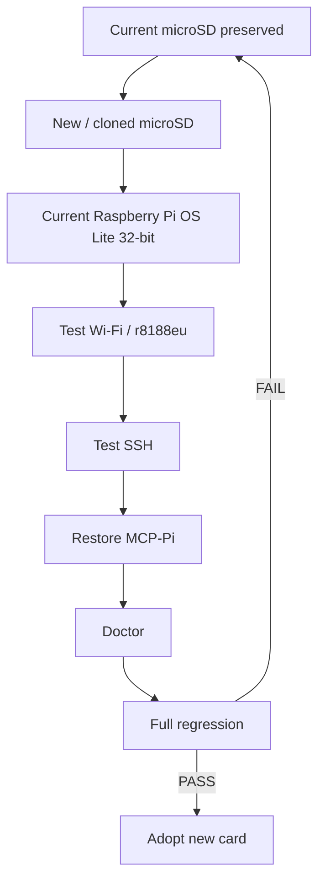

La microSD actual permanece como rollback físico.

### 19.3 Operación estable

Cadencia:

| Frecuencia | Actividad |
|---|---|
| Semanal | Doctor corto / backup |
| Mensual | Revisar updates, logs, disk, RAM |
| Trimestral | Claves, restore test, revocation |
| Antes de update | Backup + compatibility |
| Después de update | Full doctor + regression |

No actualizar automáticamente.

## 20. Services — extensión futura opcional

Después de v1 o si aparece necesidad real:

```text
Services
```

representará servidores MCP externos.

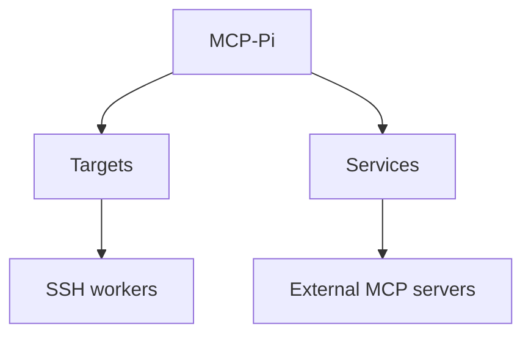

Official MCP Registry puede usarse como catálogo de descubrimiento.

No confundir:

```text
Target != Service
```

Un Target es una máquina/workspace.

Un Service ya habla MCP.

## 21. Qué NO integrar

No incorporar por ahora:

- ContextForge completo;
- ToolHive completo;
- Docker;
- Kubernetes;
- Redis;
- PostgreSQL;
- OPA;
- Cedar;
- Prometheus;
- Grafana;
- OpenTelemetry Collector;
- React;
- Vue;
- Angular;
- Node runtime en la Pi;
- Code Mode / meta-tools;
- job system propio.

Reconsiderar sólo cuando exista una necesidad medible.

## 22. Riesgos actuales

| Riesgo | Estado | Mitigación |
|---|---|---|
| Bullseye EOL | ALTO | Phase 7 migration |
| ARMv6 | CONTROLADO | cross-build + pinned releases |
| 176 MiB RAM | CONTROLADO | <25 MiB servicios actuales |
| Wi-Fi USB único | CONTROLADO | no OS upgrades improvisados |
| Prompt injection | CONTROLADO | narrow tools + Core policy |
| MCP changes | CONTROLADO | official SDK + contract versions |
| DB migration | PENDIENTE 4D | manifest + schema gate + backup |
| Update incompatibility | PENDIENTE 4D | doctor + rollback |
| Web/MCP HTTP origin attack | PENDIENTE 4D | explicit Origin/Host tests |
| Concurrent writes | PENDIENTE 5 | expected SHA-256 |
| Client impersonation | PENDIENTE 6 | authenticated upstream identity |

## 23. ADR — decisiones consolidadas

### ADR-001 — Raspberry Pi A+ se mantiene

**ACCEPTED**

La carga real demuestra viabilidad.

### ADR-002 — Pi-hole separado

**ACCEPTED**

### ADR-003 — CLI/minimal OS

**ACCEPTED**

### ADR-004 — No Docker inicialmente

**ACCEPTED**

### ADR-005 — Targets hacen el trabajo pesado

**ACCEPTED**

### ADR-006 — SSH como transporte principal a Targets

**ACCEPTED**

### ADR-007 — No arbitrary shell v1

**ACCEPTED**

### ADR-008 — AI-client agnostic

**ACCEPTED**

### ADR-009 — Multi-target

**ACCEPTED**

### ADR-010 — Multi-project

**ACCEPTED**

### ADR-011 — Admin Console local

**ACCEPTED**

### ADR-012 — SQLite primary / JSON fallback

**ACCEPTED**

### ADR-013 — Tailwind precompiled

**ACCEPTED**

### ADR-014 — Single Core

**ACCEPTED**

### ADR-015 — localhost-first

**ACCEPTED**

### ADR-016 — Official MCP SDK

**ACCEPTED**

### ADR-017 — Go adapter + Python Core

**ACCEPTED**

### ADR-018 — Compatibility before writes

**ACCEPTED**

### ADR-019 — Versioned lifecycle

**ACCEPTED**

### ADR-020 — No auto-update

**ACCEPTED**

### ADR-021 — Reuse-first ecosystem policy

**ACCEPTED**

### ADR-022 — Services optional, separate from Targets

**ACCEPTED**

## 24. Definition of Done v1.0

MCP-Pi v1.0 se considera terminado cuando:

```text
[ ] Phase 4D PASS
[ ] Compatibility contracts versioned
[ ] Doctor / repair / lifecycle complete
[ ] Installation reproducible
[ ] Update + rollback proven
[ ] Backup + restore proven
[ ] Uninstall + purge proven

[x] Controlled write (`write_file`) implemented and validated
[x] expected SHA-256
[x] atomic write
[x] write kill switch
[x] recovery test
[ ] `apply_patch` may remain deferred if safe implementation is not justified

[ ] At least one authenticated AI/MCP client integrated
[ ] Client grants enforce tools/list and tools/call
[ ] Client credentials not stored unsafely

[ ] At least one real Target Worker validated
[ ] Multi-project validated
[ ] Target/project disable validated
[ ] Global kill switch validated

[ ] Origin / Host / DNS rebinding tests PASS
[ ] MCP native conformance PASS
[ ] Negative security suite PASS

[ ] OS migration plan executed OR explicit residual-risk decision documented
[ ] Recovery path documented and tested
[ ] Documentation current
```

## 25. Estado oficial al cierre de v0.5

```text
PROJECT:
MCP-Pi Gateway

DOCUMENT:
0.6

CURRENT PHASE:
5 PASS

NEXT:
4D — Compatibility, Security & Lifecycle Foundation
(hardening catch-up before Phase 6)

GATEWAY:
MCP-Pi
192.168.68.85

PI-HOLE:
YorPi
192.168.68.54
DO NOT MODIFY

FIRST TARGET:
termux-main
192.168.68.84:8022

ADMIN:
127.0.0.1:8080
Flask + Jinja + Tailwind
SSH tunnel only

MCP:
Official Go SDK v1.7.0
127.0.0.1:8090/mcp
stdio + Streamable HTTP

CORE:
Python
Single security authority

REGISTRY:
SQLite primary
JSON fallback

TOOLS:
9 tools total

WRITE:
write_file IMPLEMENTED
apply_patch DEFERRED_FOR_SAFE_IMPLEMENTATION

ARBITRARY SHELL:
DISABLED / OUT OF V1

AUTO UPDATE:
NO

OS:
Debian 11 Bullseye
EOL — migration planned

KISS:
MANDATORY

REUSE-FIRST:
MANDATORY
```

## 26. Referencias externas verificadas para esta versión

Estas fuentes deberán revisarse de nuevo cuando cambie una fase dependiente de ellas:

- Model Context Protocol — Specification 2026-07-28.
- Official MCP Go SDK — compatibility matrix and v1.7.0 release notes.
- Official MCP Go SDK — Streamable HTTP / Origin and localhost protection.
- ToolHive — tool filtering and common admission/authorization seam.
- mcp-gway — local-first SSR dashboard, HTMX/Tailwind patterns.
- OpenAI Help Center — private/local MCP connectivity and Secure MCP Tunnel.
- Debian Project — Debian 11 Bullseye LTS end-of-life, 31 Aug 2026.
- Raspberry Pi — Raspberry Pi OS Lite 32-bit / Debian 13 compatibility.

## 27. Regla para toda fase futura

Antes de comenzar una nueva fase:

```text
1. Read this master document.
2. Read AGENTS.md.
3. Read current project-state.md.
4. Run baseline regression.
5. Check ecosystem/official standards for reusable solutions.
6. Make the smallest change that satisfies the requirement.
7. Run positive + negative tests.
8. Measure resource impact.
9. Update documentation.
10. Create rollback point.
```

> **MCP-Pi debe crecer por composición de piezas pequeñas y estables, no por acumulación de frameworks.**


## 28. Phase 5 completion record

```text
COMMIT:
1147017

TAG:
phase-5-pass

PYTHON:
88 / 88 PASS

GO:
4 / 4 PASS

CONTROLLED WRITE E2E:
19 / 19 PASS

MCP TOOLS:
9

WRITE_FILE:
PASS

APPLY_PATCH:
DEFERRED_FOR_SAFE_IMPLEMENTATION

PI-HOLE:
UNCHANGED
```

### 28.1 Important roadmap correction

The project must **not** proceed directly to generic public/reverse tunnels.

For ChatGPT specifically, current OpenAI guidance requires revalidation of **Secure MCP Tunnel** for private/local MCP deployments rather than exposing MCP-Pi to the public internet.

Therefore:

```text
Phase 5 PASS
    ↓
Phase 4D hardening / lifecycle catch-up
    ↓
Phase 6 client-specific integration gates
```

Different clients may use different transports:

```text
Claude Desktop / local clients
→ stdio or local/SSH-tunneled MCP

ChatGPT
→ Secure MCP Tunnel if supported/eligible

Other clients
→ individually validated transport/auth
```

No generic tunnel becomes part of the core architecture.
