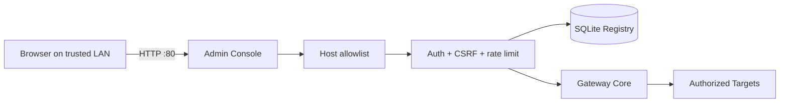

# MCP Gateway — Consola de Administración

La consola web administra Targets, Projects, clientes/grants, actividad, diagnóstico y kill switches usando el mismo Gateway Core que MCP. La implementación prioriza KISS: Flask/Jinja, SQLite y Tailwind precompilado, sin framework SPA ni CDN.

## Acceso actual

Producción:

- URL LAN: `http://192.168.68.55`
- Servicio: `mcp-gateway-admin.service`
- Usuario de servicio: `mcp-gateway`
- Bind configurable con `MCP_ADMIN_HOST` / `MCP_ADMIN_PORT`
- Allowlist: `MCP_ADMIN_ALLOWED_HOSTS`

La unidad de producción escucha en `0.0.0.0:80` y permite `127.0.0.1`, `localhost`, `192.168.68.55` y `mcp-pi`. El MCP adapter **no** se expone por LAN: permanece en `127.0.0.1:8090/mcp`. En redes no confiables se recomienda un túnel SSH en lugar de HTTP LAN directo.



## Seguridad

- Login local con hash de contraseña y rate limiting.
- Cookies `HttpOnly` + `SameSite=Strict`; sesiones con expiración por inactividad.
- CSRF obligatorio en mutaciones.
- `Host` allowlist para evitar host-header abuse/DNS rebinding.
- CSP: scripts solo `self`, sin JavaScript inline; estilos locales con Tailwind precompilado.
- `X-Content-Type-Options`, `X-Frame-Options`, `Referrer-Policy` y `Cache-Control: no-store`.
- SQL parametrizado; secretos fuera del repositorio.
- `gateway_enabled` funciona como kill switch global.
- `writes_enabled` controla structured filesystem mutations; `run_command` se autoriza por grants separados.

## UX actual

La UI incluye navegación responsive accesible, estado de sección con `aria-current`, skip link, targets táctiles de al menos 44 px, tablas desplazables con región enfocables, labels programáticos, mensajes `aria-live`, estados vacíos y confirmación consistente para acciones sensibles.

## Secciones

- `/dashboard`: estado operativo y actividad reciente.
- `/targets`: configuración y prueba de conectividad.
- `/projects`: roots autorizados y permisos.
- `/clients`: identidades de clientes IA.
- `/activity`: auditoría.
- `/system`: runtime/hardware.
- `/settings`: límites, kill switch y structured writes.
- `/maintenance`: Doctor, backups, repair y rollback.

## Desarrollo del frontend

```bash
python -m unittest tests.test_web_security tests.test_web_views -v
node tests/test_app_js.mjs
cd tailwind && npm run build
```

Node.js solo es necesario para compilar Tailwind en desarrollo; la Pi recibe `app.css` precompilado.
