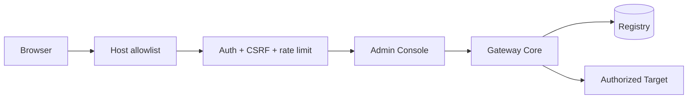

# Admin Console

The Admin Console is the human configuration surface for Targets, Projects, AI clients, grants, activity, health and kill switches. It uses the same Gateway Core/Registry as MCP.

## Access

After installation, use the appliance address permitted by its private `admin.env`, for example:

```text
http://<gateway-ip>/
```

The versioned unit itself defaults to loopback. LAN exposure is a machine-local choice written outside Git.



## First login

Bootstrap an Admin account with:

```bash
sudo -u mcp-gateway mcp-gateway setup
```

`setup` intentionally does not duplicate all Admin forms in the CLI. After Admin authentication, create Targets, Projects, clients and grants in the web UI.

## Sections

- **Dashboard** — operational summary and recent activity.
- **Targets** — endpoint/platform/identity-related configuration and connectivity test.
- **Projects** — authorized roots and read/write policy.
- **Clients** — AI client identities and effective capabilities.
- **Activity** — audit records.
- **System** — runtime/hardware information.
- **Settings** — limits and kill switches.
- **Maintenance** — Doctor, backup and safe maintenance actions.

## Security

- local password hashes;
- login rate limiting;
- CSRF on state changes;
- explicit Host allowlist;
- strict security headers/CSP;
- local vendored frontend assets;
- `HttpOnly` and `SameSite=Strict` session cookies;
- SQL parameterization;
- `mcp-gateway` service user;
- only `CAP_NET_BIND_SERVICE` for TCP/80 when needed.

`gateway_enabled`, `writes_enabled` and `shell_enabled` are independent operational switches. See [security.md](security.md).

## Frontend development

Node.js is needed only to rebuild/test frontend assets on a development host:

```bash
node tests/test_app_js.mjs
cd tailwind && npm run build
```

Production receives compiled assets and does not need Node.js.
