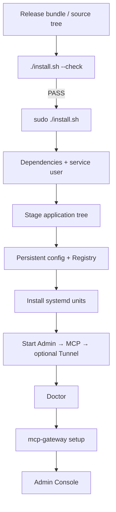

# Installation

`install.sh` is the canonical **user installation/reinstallation entrypoint**. It is intentionally separate from `scripts/deploy-pi.sh`, which is a maintainer exact-commit promotion tool.

## Supported path



## Release bundle versus source checkout

### Recommended: official release bundle

The release bundle contains:

- Python Gateway source;
- systemd configuration;
- CLI wrappers;
- `manifest.json` / `compatibility.json`;
- prebuilt Linux ARMv6 MCP adapter;
- checksums.

Therefore constrained ARMv6 appliances do not need Go to install.

### Source checkout

A source checkout can run:

```bash
./install.sh --check
```

If `bin/mcp-gateway-adapter` is absent, the script will only build an adapter when Go is already installed. It does **not** install Go on a constrained appliance. Maintainers should build release artifacts on a development host.

## Preflight

```bash
./install.sh --check
```

This performs no system mutation. It validates required files, Python/dependencies and an adapter usable for the detected architecture.

## Install or reinstall

```bash
sudo ./install.sh
```

The installer:

1. verifies root/system prerequisites;
2. installs Flask/Werkzeug from the Debian package manager if they are missing;
3. creates the `mcp-gateway` system user if needed;
4. stages the application from the directory containing `install.sh`;
5. generates the private MCP adapter token if absent;
6. creates `admin.env` if absent, using the detected hostname/LAN address;
7. initializes or preserves the SQLite Registry;
8. preserves the previous installer-managed runtime and systemd units;
9. activates the candidate application tree;
10. restarts Admin → MCP → optional Tunnel in dependency order;
11. requires Doctor to pass;
12. launches setup only when stdin is interactive.

Persistent state is separate from application code:

```text
/home/mcp-gateway/mcp-gateway/                  application
/home/mcp-gateway/.local/share/mcp-gateway/    Registry + backups
/home/mcp-gateway/.config/mcp-gateway/          secrets + local runtime config
```

The installer never expects secrets to be committed to Git.

## Security defaults on a new Registry

```text
gateway_enabled = true
writes_enabled  = false
shell_enabled   = false
```

Existing Registries preserve their values during reinstall/update.

## Setup

```bash
sudo -u mcp-gateway mcp-gateway setup
```

Setup has one deliberately small responsibility: establish Admin access and run Doctor. Target/Project/client/grant configuration stays in Admin Console instead of duplicating the entire Admin UI in a CLI wizard.

For automation, the Admin password can be supplied once on stdin:

```bash
printf '%s\n' "$ADMIN_PASSWORD" | sudo -u mcp-gateway mcp-gateway setup --password-stdin
```

Do not put the password in shell history or Git.

## Installer rollback

If the new installer-managed runtime is unhealthy during activation, the installer attempts to restore the previous runtime and units. A retained previous runtime can also be restored explicitly:

```bash
sudo /home/mcp-gateway/mcp-gateway/install.sh --rollback
```

Successful rollback prints `ROLLBACK_VERIFIED` only after services and Doctor recover.

## OpenAI Secure MCP Tunnel

The base Gateway works without a cloud tunnel. If an official tunnel client and `tunnel.env` are already provisioned, the installer preserves that private configuration and can restart the service. Tunnel credentials are not created or guessed by the installer.

See [configuration.md](configuration.md) and [security.md](security.md).
