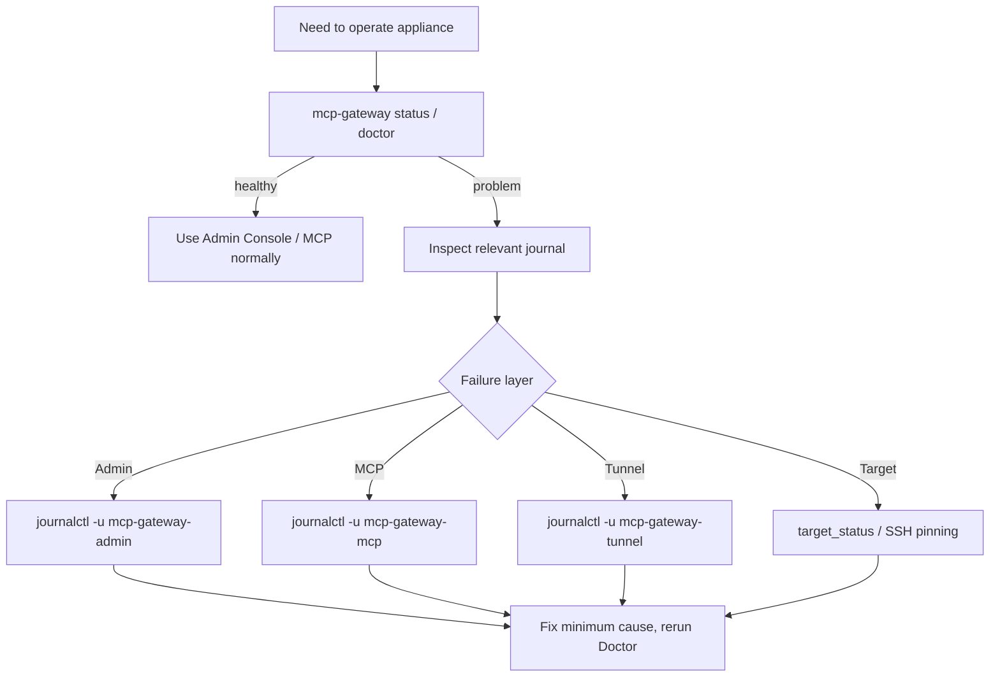

# Operations

This guide covers normal operation of an installed Local-miniMCP appliance. Installation/update procedures live in separate guides so routine administration stays short.

## Quick health

```bash
sudo -u mcp-gateway mcp-gateway status
sudo -u mcp-gateway mcp-gateway doctor
```

Service-level check:

```bash
systemctl is-active mcp-gateway-admin mcp-gateway-mcp
systemctl is-active mcp-gateway-tunnel  # only when the optional tunnel is configured/enabled
```

MCP probes are loopback-only:

```bash
curl -fsS http://127.0.0.1:8090/live
curl -fsS http://127.0.0.1:8090/ready
```

## Daily model



Diagnose one layer at a time. Do not change policy, delete Registry data or disable host-key checks merely to make a symptom disappear.

## Admin Console

Open the trusted address configured in private `admin.env`. Machine-specific IPs are intentionally not part of the versioned product configuration.

Use Admin Console for:

- Targets and connectivity tests;
- Projects and roots;
- clients/grants;
- audit activity;
- limits and kill switches;
- Doctor/maintenance actions.

## Kill switches

Fresh defaults keep writes and trusted shell disabled. An existing production instance may intentionally have different persisted values.

Before changing a switch, understand its scope:

```text
gateway_enabled -> normal Gateway operations
writes_enabled  -> structured filesystem mutations
shell_enabled   -> trusted Target shell
```

Do not conflate `writes_enabled` with `run_command`; they are deliberately independent security controls.

## Backup

```bash
sudo -u mcp-gateway mcp-gateway backup
```

The backup uses SQLite's online backup API. Keep important backups off-device and encrypt private archives when leaving the appliance.

## Maintenance

```bash
sudo -u mcp-gateway mcp-gateway maintenance
```

Maintenance is intentionally conservative: Registry backup/rotation, integrity/Doctor and lightweight resource/update preview. It is not an unattended OS auto-updater.

## Logs

```bash
journalctl -u mcp-gateway-admin -n 100 --no-pager
journalctl -u mcp-gateway-mcp -n 100 --no-pager
journalctl -u mcp-gateway-tunnel -n 100 --no-pager
```

Classify deliberate service stops/restarts separately from crash loops, traceback, permission errors, bind failures or authentication failures.

## Restart order

When a restart is actually needed:

```text
Admin
→ MCP adapter (wait for /ready)
→ optional Tunnel
```

The tunnel depends on the MCP backend. Avoid restarting the whole appliance when a single service can be repaired.

## Updates

Do not update application code by copying arbitrary files into the live runtime. Use [update-rollback.md](update-rollback.md).

## Recovery

For Registry restore, lost runtime or disaster recovery use [recovery.md](recovery.md). For diagnosis use [troubleshooting.md](troubleshooting.md).
