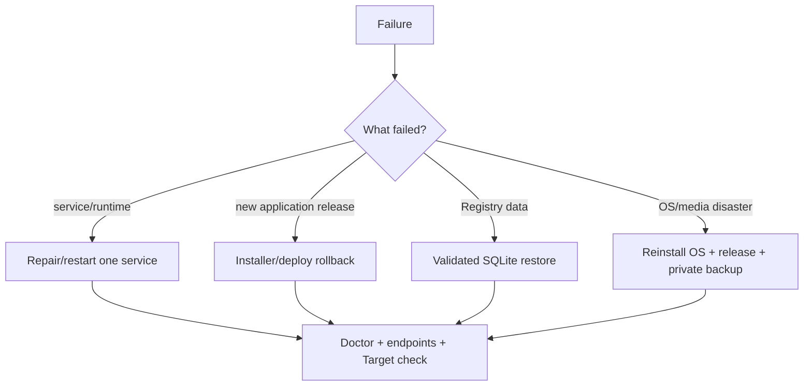

# Recovery

Recovery is split into three levels so the smallest safe action is used first.



## 1. Service/runtime issue

Start with [troubleshooting.md](troubleshooting.md), relevant journals and Doctor. Do not restore data when the actual issue is a stopped service or bad unit.

## 2. Application rollback

For an installer-managed update:

```bash
sudo /home/mcp-gateway/mcp-gateway/install.sh --rollback
```

For maintainer exact-commit deployments, use the rollback mechanism in `scripts/deploy-pi.sh`; do not invent a parallel manual layout.

## 3. Registry backup

Create a consistent online backup:

```bash
sudo -u mcp-gateway mcp-gateway backup
```

Backups live under the persistent data directory unless a destination is supplied. Copy critical recovery material off-device and encrypt it where appropriate.

## 4. Registry restore

Before restoring, identify the intended backup and verify it is trusted. The CLI validates SQLite integrity/schema before replacing the active database through SQLite's backup API:

```bash
sudo -u mcp-gateway mcp-gateway restore /path/to/gateway_backup.db
```

Then run:

```bash
sudo -u mcp-gateway mcp-gateway doctor
```

A restore is not successful merely because the file copied.

## 5. Disaster recovery

A full appliance rebuild requires:

1. supported Linux/systemd OS;
2. official MCP-Pi release bundle;
3. persistent Registry backup;
4. private Admin/tunnel configuration if used;
5. SSH identities/known-host material if those identities must be preserved;
6. installation + restore;
7. permissions review;
8. Doctor/endpoints/Target acceptance.

Do not commit recovery secrets to Git.

## Acceptance after recovery

At minimum verify:

- expected Gateway/API/schema contracts;
- SQLite `integrity_check=ok`;
- service user and sensitive-file permissions;
- Admin/MCP services active;
- MCP `/live` and `/ready`;
- expected client/grant/Target/Project records;
- Target SSH fingerprint and reachability;
- no unexpected public listeners;
- Doctor without error-severity failures.

Historical machine-specific disaster-recovery evidence is preserved under [`archive/`](archive/); it is not the generic recovery contract.
