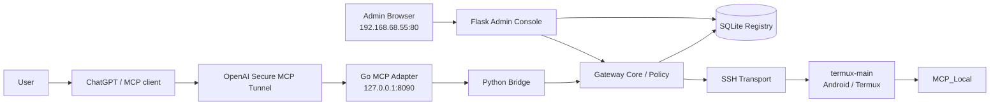
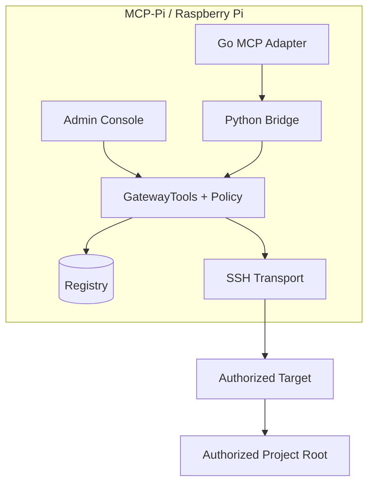
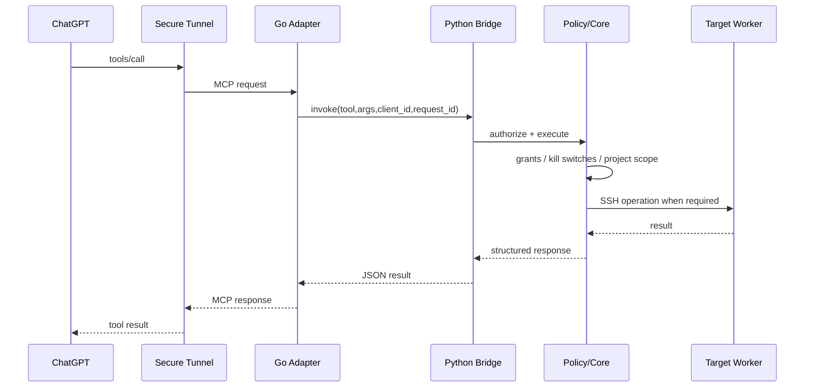
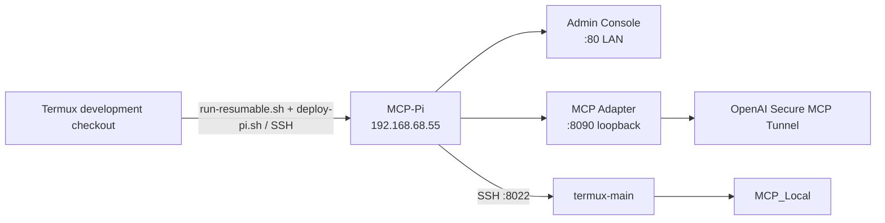

# Architecture Diagrams

These diagrams describe the current production architecture, not historical phase snapshots.

## System architecture

## Component boundaries

## MCP tool-call sequence

## Deployment topology

