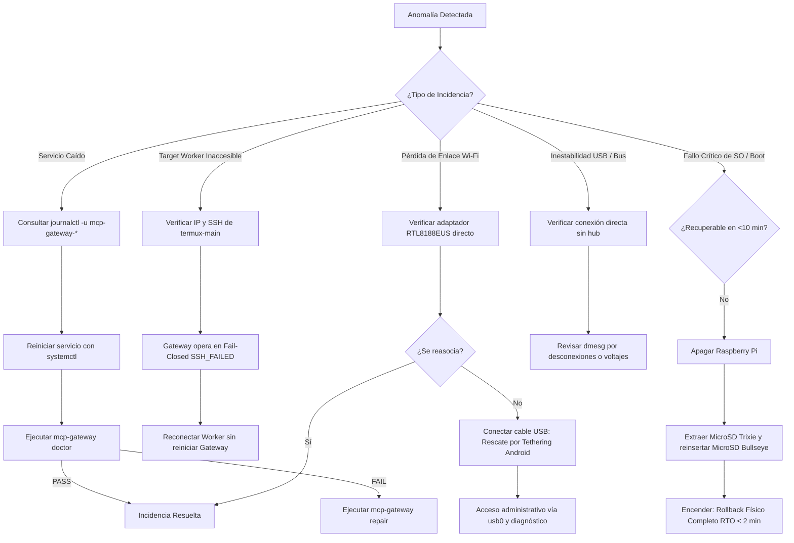

# Runbook: Operaciones Cotidianas, Mantenimiento e Incidentes (Operations Baseline)

Este documento establece la **fuente única de verdad consolidada** para la administración, verificación de salud, ciclo de mantenimiento, gestión de actualizaciones y respuesta ante incidencias de **MCP-Pi Gateway v1.0.1** sobre **Raspberry Pi OS Lite 32-bit (Debian 13 Trixie)** en la **Raspberry Pi Model A+ Rev 1.1**.

---

## 1. Parámetros del Sistema y Credenciales

| Componente | Valor Autorizado | Notas |
|---|---|---|
| **Hostname** | `MCP-Pi` | Identidad LAN |
| **Endpoint LAN** | `192.168.68.85/22` | Asignado vía DHCP con reserva MAC |
| **MAC wlan0** | `8c:90:2d:ac:e5:c0` | Adaptador USB Realtek RTL8188EUS (`0bda:8179`) |
| **Driver Wi-Fi** | `rtl8xxxu` (`mac80211`) | In-tree nativo en Debian 13 Trixie |
| **Usuario Administrativo** | `yorologo` (UID 1000) | Acceso SSH mediante `~/.ssh/id_ed25519` |
| **Usuario de Servicio** | `mcp-gateway` (UID 102, GID 105) | Sin privilegios sudo, sin login por password |
| **Host Key SSH MCP-Pi** | `SHA256:wovttruok3M1sdIkGHUs6pMbwKvTYylrh+Maz4Iv84E` | Fijado en `~/.ssh/mcp_known_hosts` |
| **Admin Console** | `127.0.0.1:8080` | Confinado a loopback (túnel SSH) |
| **Servidor MCP** | `127.0.0.1:8090/mcp` | Confinado a loopback (Streamable HTTP / Stdio) |
| **Target Canónico** | `termux-main` (`192.168.68.72:8022`) | Fingerprint: `SHA256:qILA9dmqZNJS7PaxqDtC7weR4NdcGhruxsUYHpPish0` |
| **Infraestructura Pi-hole** | `192.168.68.54` (`YorPi`) | **ESTRICTAMENTE FUERA DE ALCANCE — NO MODIFICAR** |
| **Rollback Físico** | MicroSD original Debian 11 Bullseye | `PRESERVED AS KNOWN_GOOD_PHYSICAL_ROLLBACK` |

---

## 2. Operaciones Cotidianas

### 2.1 Arranque y Apagado Seguro

- **Arranque normal:** Conectar alimentación microUSB (5V, ≥1.5A). El sistema arranca de forma autónoma:
  - Carga el kernel `6.18.34+rpt-rpi-v6 armv6l`.
  - Inicializa Wi-Fi RTL8188EUS vía `rtl8xxxu` y obtiene IP en ~35–45 segundos.
  - Inicia `mcp-gateway-admin.service` y `mcp-gateway-mcp.service` bajo `mcp-gateway`.
- **Apagado seguro:**
  ```bash
  ssh yorologo@192.168.68.85 "sudo shutdown -h now"
  ```
- **Reinicio planificado:**
  ```bash
  ssh yorologo@192.168.68.85 "sudo sync && sudo reboot"
  ```

### 2.2 Verificación Rápida de Salud (Quick Health)

Desde la estación de trabajo (PC):

```bash
# 1. Comprobar servicios systemd
ssh yorologo@192.168.68.85 "systemctl is-active mcp-gateway-admin mcp-gateway-mcp"
# Salida esperada: active / active

# 2. Diagnóstico integral con Doctor
ssh yorologo@192.168.68.85 "sudo -u mcp-gateway /home/mcp-gateway/mcp-gateway/bin/mcp-gateway doctor"
# Salida esperada: OVERALL STATUS: HEALTHY (19/19 PASS)

# 3. Estado del target worker
ssh yorologo@192.168.68.85 "curl -s -H 'Host: 127.0.0.1' -H 'Content-Type: application/json' -H 'Accept: application/json, text/event-stream' -d '{"jsonrpc":"2.0","id":1,"method":"tools/call","params":{"name":"target_status","arguments":{"target":"termux-main"}}}' http://127.0.0.1:8090/mcp"
```

### 2.3 Acceso a la Consola de Administración Web

La consola web corre exclusivamente en loopback (`127.0.0.1:8080`). Para acceder desde el navegador local:

```bash
# Crear túnel seguro local
ssh -N -L 8080:127.0.0.1:8080 yorologo@192.168.68.85
```

Abrir en el navegador local: `http://127.0.0.1:8080`

### 2.4 Política y Gestión de Escrituras Controladas

- **Default:** `writes_enabled = false` (Deny by default).
- Para habilitar temporalmente escrituras autorizadas (requiere grant y proyecto explícito):
  - Mediante Web Admin: Menú Settings → Enable Writes.
  - Mediante CLI administrativo:
    ```bash
    ssh yorologo@192.168.68.85 "sudo -u mcp-gateway python3 -c \"import sqlite3; con = sqlite3.connect('/home/mcp-gateway/.local/share/mcp-gateway/gateway.db'); con.cursor().execute('UPDATE settings SET value=\\\"true\\\" WHERE key=\\\"writes_enabled\\\";'); con.commit(); con.close();\""
    ```
- **Botón de pánico (Emergency writes disable):**
  ```bash
  ssh yorologo@192.168.68.85 "sudo -u mcp-gateway python3 -c \"import sqlite3; con = sqlite3.connect('/home/mcp-gateway/.local/share/mcp-gateway/gateway.db'); con.cursor().execute('UPDATE settings SET value=\\\"false\\\" WHERE key=\\\"writes_enabled\\\";'); con.commit(); con.close();\""
  ```

---

## 3. Respaldo y Restauración (Backup & Restore)

### 3.1 Respaldo en Caliente (Online Backup)

La base de datos SQLite se respalda sin detener servicios mediante la API online de backup:

```bash
# Ejecutar respaldo en la Pi
ssh yorologo@192.168.68.85 "sudo -u mcp-gateway python3 -c \"
import sqlite3
src = sqlite3.connect('/home/mcp-gateway/.local/share/mcp-gateway/gateway.db')
dst = sqlite3.connect('/tmp/gateway_backup.db')
src.backup(dst)
dst.close()
src.close()
\""

# Transferir a la bóveda local fuera de Git
scp yorologo@192.168.68.85:/tmp/gateway_backup.db ~/.mcp_migration_backup/post_trixie_promotion/
ssh yorologo@192.168.68.85 "rm -f /tmp/gateway_backup.db"
```

### 3.2 Restauración del Registry

Ante inconsistencia o pérdida de datos:

1. Detener servicios:
   ```bash
   ssh yorologo@192.168.68.85 "sudo systemctl stop mcp-gateway-admin mcp-gateway-mcp"
   ```
2. Copiar archivo desde la bóveda:
   ```bash
   scp ~/.mcp_migration_backup/post_trixie_promotion/gateway.db yorologo@192.168.68.85:/tmp/
   ssh yorologo@192.168.68.85 "sudo cp /tmp/gateway_backup.db /home/mcp-gateway/.local/share/mcp-gateway/gateway.db && sudo chown mcp-gateway:mcp-gateway /home/mcp-gateway/.local/share/mcp-gateway/gateway.db && sudo chmod 600 /home/mcp-gateway/.local/share/mcp-gateway/gateway.db && rm -f /tmp/gateway_backup.db"
   ```
3. Iniciar servicios y validar con Doctor:
   ```bash
   ssh yorologo@192.168.68.85 "sudo systemctl start mcp-gateway-admin mcp-gateway-mcp"
   ssh yorologo@192.168.68.85 "sudo -u mcp-gateway /home/mcp-gateway/mcp-gateway/bin/mcp-gateway doctor"
   ```

---

## 4. Política de Mantenimiento Preventivo

Dado el perfil de hardware de la Raspberry Pi Model A+ (1 core ARMv6, ~173 MiB RAM), se aplica una política **KISS**: cero agentes de monitoreo pesados, cero Prometheus/Grafana, cero Docker.

| Frecuencia | Actividad de Mantenimiento | Comandos de Referencia | Criterio de Aceptación |
|---|---|---|---|
| **Semanal** | Inspección de Salud y Recursos | `sudo -u mcp-gateway ... doctor`<br>`free -m`<br>`df -h /`<br>`vcgencmd measure_temp`<br>`vcgencmd get_throttled` | Doctor: 19/19 HEALTHY<br>RAM libre: >60 MiB disponibles<br>Disco: <50% ocupado<br>Temperatura: <65 °C<br>Throttled: `0x0` |
| **Mensual** | Respaldo y Revisión de Logs | Script de respaldo a vault<br>`journalctl -u mcp-gateway-* -p err --since "30 days ago"`<br>`dmesg \| grep -E -i "oom\|reset"` | Respaldo íntegro (`ok`)<br>Cero errores no gestionados<br>Cero eventos OOM o USB resets |
| **Trimestral** | Higiene de Claves y Conectividad | Comprobar fingerprints SSH host y target<br>`scripts/verify_protocol_and_targets.py` | Fingerprints inmutables<br>Operaciones con targets 100% funcionales |
| **Bajo Demanda** | Evaluación de Parches del SO | `apt update && apt list --upgradable` | Clasificar según Política de Actualizaciones |

---

## 5. Política de Actualizaciones (Update Policy)

### 5.1 Distinción Fundamental: Aplicación vs Sistema Operativo

```text
MCP-Pi Gateway (Aplicación):
- Versión v1.0.1 congelada e inmutable (Commit bcd8fe907f9e305733896f1d286d04d57a8b1f5e).
- Solo cambia mediante release formal planificada (develop -> hardware test -> main -> tag).
- Cero auto-updates.

Raspberry Pi OS / Debian 13 Trixie (Sistema Operativo):
- Se mantiene con repositorios oficiales de Trixie.
- Requiere evaluación previa antes de aplicar parches.
- Preserva siempre la ruta de rollback físico.
```

### 5.2 Clasificación de Cambios y Gates Obligatorios

| Tipo de Cambio | Ejemplos | Procedimiento Requerido | Gate de Aceptación |
|---|---|---|---|
| **NORMAL_MAINTENANCE** | Parches de seguridad de utilidades (`tzdata`, `curl`, `openssl`, `bash`) | `sudo apt update && sudo apt install --only-upgrade <pkg>`<br>Reiniciar servicios gateway | Doctor 19/19 HEALTHY<br>Cero regresión en endpoints |
| **REBOOT** | Actualización de kernel o firmware (`raspberrypi-kernel`, firmware BCM) | `sudo apt upgrade`<br>`sudo sync && sudo reboot` | Auto-reconexión Wi-Fi<br>0 unidades systemd fallidas<br>Doctor 19/19 HEALTHY |
| **REGRESSION** | Actualización de runtime Python o subsistema `mac80211`/`rtl8xxxu` | Ejecutar batería completa de regresión (`scripts/verify_protocol_and_targets.py`, `scripts/verify_security_negative.py`) | 100% tests PASS en hardware real |
| **PATCH_RELEASE** | Modificación del código fuente de MCP-Pi | Flujo Git formal en `develop` con aceptación en hardware | Merge a `main`, release tag oficial |
| **ROLLBACK** | Fallo crítico no recuperable o incompatibilidad fatal de paquetes | Insertar microSD Bullseye original preservada | RTO < 2 minutos |

---

## 6. Manejo de Incidentes y Árbol de Decisiones (Decision Tree)

Ante cualquier anomalía operativa, seguir estrictamente este flujo:



### Reglas Invariantes de Incidentes:
1. **Deny by default & Fail-Closed:** Ante cualquier duda de autenticación, integridad o red, el gateway rechaza la operación sin exponer recursos.
2. **Pi-hole fuera de límites:** Bajo ninguna circunstancia reiniciar, alterar o conectarse a `192.168.68.54` (`YorPi`).
3. **No hub en la ruta:** El dongle RTL8188EUS debe permanecer conectado **directamente** al puerto USB de la Raspberry Pi Model A+.

---

## 7. Índice de Runbooks Especializados

Para operaciones detalladas paso a paso, referirse a los runbooks existentes en `docs/runbooks/`:

- **Diagnóstico y Reparación:** [`doctor.md`](file:///c:/Users/esaud/OneDrive/Escritorio/Proyectos/Local-miniMCP/docs/runbooks/doctor.md)
- **Recuperación tras Reinicio / Corte Eléctrico:** [`reboot-recovery.md`](file:///c:/Users/esaud/OneDrive/Escritorio/Proyectos/Local-miniMCP/docs/runbooks/reboot-recovery.md)
- **Recuperación de Enlace de Red y Rescate:** [`network-recovery.md`](file:///c:/Users/esaud/OneDrive/Escritorio/Proyectos/Local-miniMCP/docs/runbooks/network-recovery.md)
- **Swap y Rollback Físico de MicroSD:** [`microsd-recovery.md`](file:///c:/Users/esaud/OneDrive/Escritorio/Proyectos/Local-miniMCP/docs/runbooks/microsd-recovery.md)
- **Respaldo y Restauración del Registry:** [`registry-backup-restore.md`](file:///c:/Users/esaud/OneDrive/Escritorio/Proyectos/Local-miniMCP/docs/runbooks/registry-backup-restore.md)
- **Recuperación ante Desastres (Disaster Recovery):** [`disaster-recovery.md`](file:///c:/Users/esaud/OneDrive/Escritorio/Proyectos/Local-miniMCP/docs/runbooks/disaster-recovery.md)
- **Administración de Consola Web:** [`admin-console.md`](file:///c:/Users/esaud/OneDrive/Escritorio/Proyectos/Local-miniMCP/docs/runbooks/admin-console.md)
- **Operaciones de Escritura Segura:** [`controlled-write-smoke-test.md`](file:///c:/Users/esaud/OneDrive/Escritorio/Proyectos/Local-miniMCP/docs/runbooks/controlled-write-smoke-test.md) y [`write-recovery.md`](file:///c:/Users/esaud/OneDrive/Escritorio/Proyectos/Local-miniMCP/docs/runbooks/write-recovery.md)
