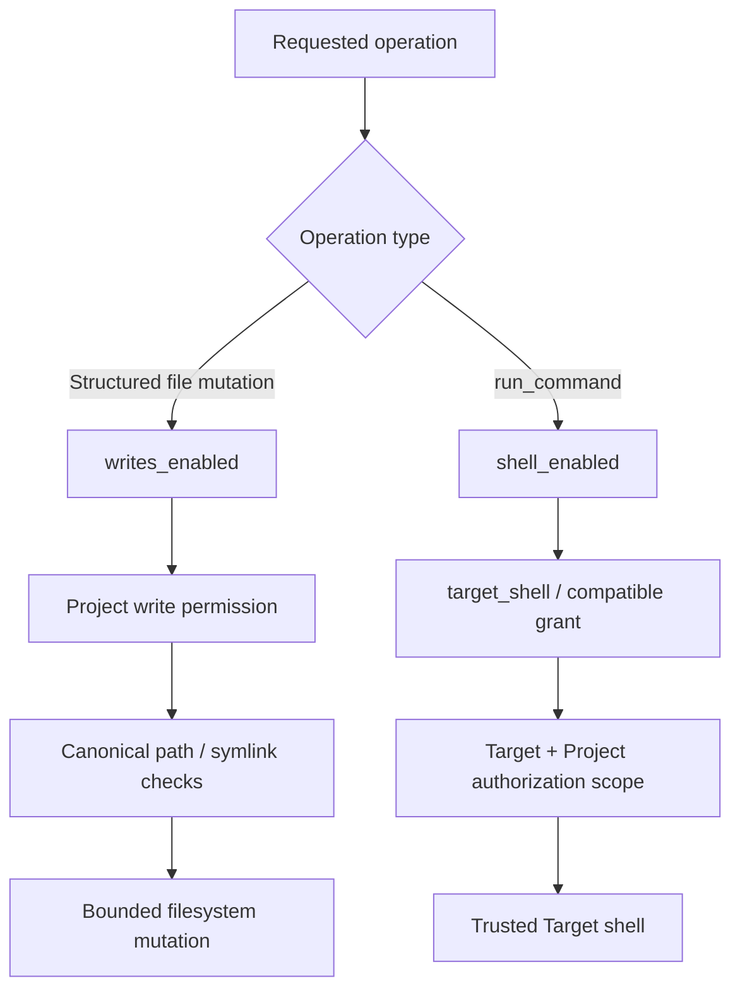

# Security model

Local-miniMCP uses explicit authorization and fail-closed behavior instead of trusting a client, IP address or shell by default.

## Core invariants

- deny by default;
- least privilege;
- fail closed on ambiguous identity, policy or compatibility;
- explicit AI client identity and grants;
- Target and Project must both be enabled;
- `StrictHostKeyChecking=yes` for SSH;
- secrets outside Git;
- Admin and MCP use one Gateway Core;
- audit attempt/result around security-sensitive mutations;
- global kill switches can stop classes of actions without deleting configuration.

## Fresh-install defaults

A newly initialized Registry starts with:

```text
gateway_enabled = true
writes_enabled  = false
shell_enabled   = false
```

These are **defaults**, not a claim about a particular running installation. Existing Registries preserve their current values across reinstall/update.

## Structured writes versus trusted Target shell



### Structured filesystem tools

`write_file`, `append_file`, `delete_file`, `copy_file`, `move_file` and `mkdir` require the write switch and Project write permission. Destinations are resolved on the Target and must remain under the canonical Project root. Symlink escapes fail closed.

### `run_command`

`run_command` is intentionally **not** presented as an arbitrary anonymous shell and not as a Project sandbox. It is available only to an authenticated client with explicit shell capability/grant, enabled Target/Project scope, `gateway_enabled=true`, `shell_enabled=true`, and audit availability.

The Project supplies authorization scope and default cwd. A shell command may have system effects outside that filesystem root, which is why this capability is higher risk and disabled by default on a fresh Registry.

## Kill switches

| Setting | Effect |
| --- | --- |
| `gateway_enabled` | blocks normal client operations globally while keeping health diagnostics available |
| `writes_enabled` | blocks structured project filesystem mutations |
| `shell_enabled` | blocks trusted Target shell execution |

The switches do not erase clients/grants/projects. They are reversible operational controls.

## SSH trust

Never replace host-key pinning with `StrictHostKeyChecking=no` or `accept-new` on production paths. A mutable IP is not identity.

Service identities should use the minimum required key options (for example `restrict` where compatible with required transport behavior) and file permissions such as `0600` for private keys/tokens.

## Admin Console

Admin security includes:

- password-hashed local Admin accounts;
- rate limiting;
- CSRF on mutations;
- Host allowlist;
- CSP and security headers;
- `HttpOnly` / `SameSite=Strict` session cookie;
- service runs as `mcp-gateway`, not root;
- only `CAP_NET_BIND_SERVICE` is granted when binding TCP/80.

Fresh unit defaults are loopback-safe. The installer may create private `admin.env` to opt the appliance into trusted-LAN access with an explicit Host allowlist.

## MCP HTTP

The MCP adapter is loopback-first. Production cloud ingress, when used, occurs through an authenticated tunnel client rather than exposing the MCP port directly to the Internet.

## Audit

Critical mutations require the audit sink to be available before execution. If audit cannot be recorded where required, the operation must fail rather than execute silently.

Activity records include actor, Target/Project scope, action, success/failure and request correlation metadata; secrets should not be logged.

## Service privileges

The runtime service user must not gain general sudo. Administrative installation/update actions are performed by a separate administrator/root path, while normal runtime remains unprivileged.

See [architecture.md](architecture.md) and [operations.md](operations.md).
